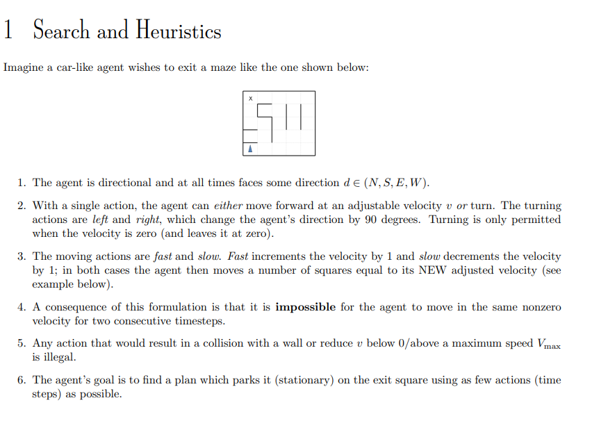

# Search

## Heuristics

- function that maps states (input) to an estimation of the distance to the end (output)
    - a cheap function to execute (simple formula)

## Admissibility, Consistency, Dominance

### Admissible

- $h(x)$ is never an overestimate, might skip nodes

### Consistency
- decrease in heuristic is upper bounded by that edge's cost

## A\* Graph Search

- Description: combines heuristic and cost
- Frontier: Priority Queue (heap)

# Worksheet

(a) If the grid is M by N, what is the size of the state space? Justify your answer. You should assume that all configurations are reachable from the start state.

