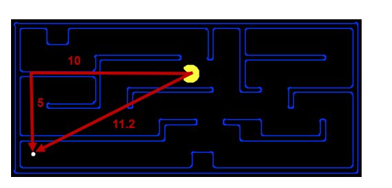
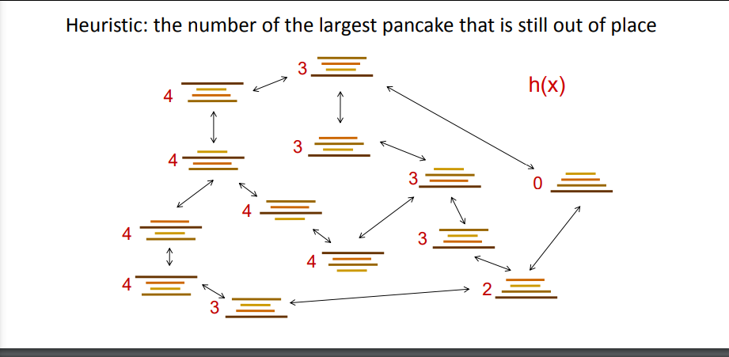
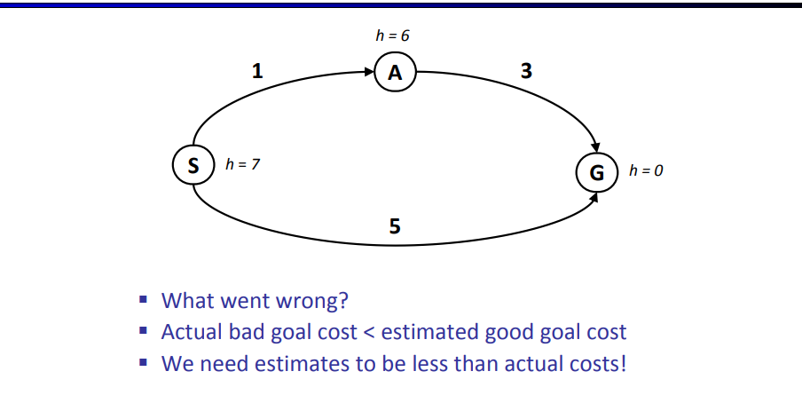
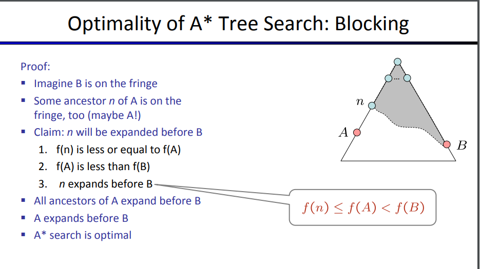
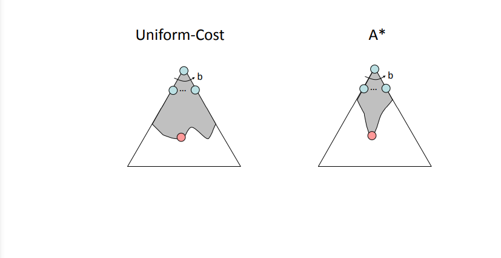

# Search Heuristics

## Heuristic

- Function that estimates how close a state is to a goal
- designed for a particular search problem
- Manhattan distance, Euclidean distance for pathing

### Pacman Example

### Pancake Example

## Greedy Search

Don't expand the node that seems the closest -> does not find best path
- Greedy
    - algorithm -> 100 -> 50 -> 0
    - correct -> 140 -> 5 -> 0

#### Strategy

**expand a node that you think is closest to a goal state**

Worst Case -> badly guided DFS

# A* Search

- **Uniform-cost**: orders by path cost, or *backward* cost $g(n)$ (does not know if it's going the wrong direction)
- **Greedy**: orders by goal proximity, or *forward* cost $h(n)$

**A\* Search** order by the sum: $f(n) = g(n) + h(n)$

##### When to terminate
Don't stop when you enqueue a goal, only stop when you deque a goal, might not find best path right away

##### Is A\* Optimal

`S (0 + 7)
    G(5 + 0)
    A(1 + 6)
`

**Estimates need to be less than the actual costs!**

Overestimate - take path that is good and scare A\* away from path
Underestimate - slow down bad plans but never outweight true costs

#### Admissibility

Admissible if:

$O \leq h(n) \leq h^*(n)$ 

where $h^*(n)$ is the true cost of the goal

#### Proof
Find optimal *A* before suboptimal *B*

Even if suboptimal solution is on the fringe, we remove some *n* before *B*

###### facts

$f(n) \leq f(A)$ 

underestimate $f(A)$ so therefore must underestimate $f(n)$

$f(A)$ is less than $f(B)$

### Properties of A\*

