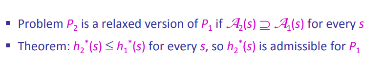
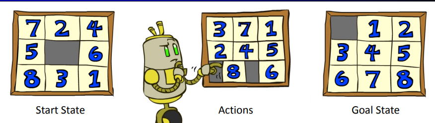
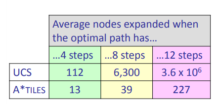
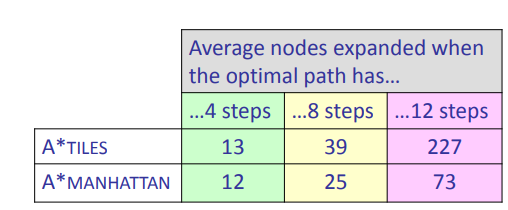
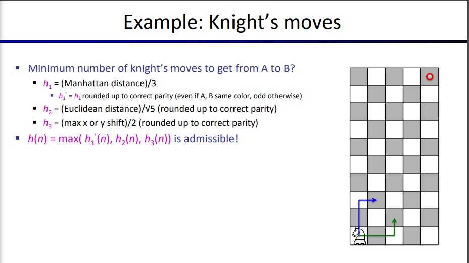

# Creating Admissible Heuristics

- admissible heuristics are solutions to **relaxed problems**, where new actions are available

- find optimal cost of relaxed problem
- lower bound of optimal cost of original problem
- so relaxed problem sol can be used for original problem

# Example: 8 Puzzle

- num of States: $9!$, reachable states are $\frac{9!}{2}$
- actions: up, left, right, down
- step costs? 1

- Heuristic: Number of tiles misplaced
- Why is it admissible? because relaxed problem is taking a tile and putting it wherever we want
- $h(start) = 8$ 
    - 8 tiles start off misplaced 

## Part 2

- What if we had an easier puzzle where any tile could slide any direction at any time, ignoring other tiles?
- Total *Manhattan* distance
- Why admissible? 
- $h(start) = 3 + 1 + 2 + ... = 18$

## Combining heuristics

- Dominance $h_1 \geq h_2$
    - $\forall h_1(n) \geq h_2(n)$
    - larger is better as long as both are admissible
    - zero heuristic is pretty bad
    - The extra heuristic is p good, but usually too expensive
- What if we have two heuristics, neither dominates the other?
    - $h(n) = max(h_1(n), h_2(n))$

## Knight Moves

- Manhattan distance / 3 -> knight moves 3 manhattan steps 
