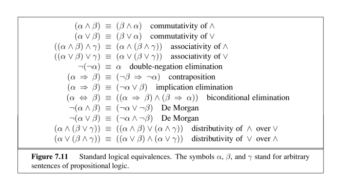
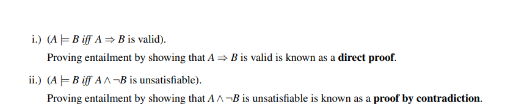

## Propositional Logic

- For $N$ symbols, we have $2^N$ symbols

## Entailment

Can say a sentence `A` **entails** another sentence `B` if in all models that `A` is true, `B` is as well. 

$A \vDash B$ -> models of $A$ are a subset of the models of $B$

$(M(A) \subseteq M(B))$

Inference problem can be formulated as figuring out whether $KB \vDash q$, where $KB$ is knowledge base and $q$ is query.

### theorems

## Model Checking

# Naive

- For all $KB$ that are true, then $q$ is true
- Need to check $2^{n}$ models
