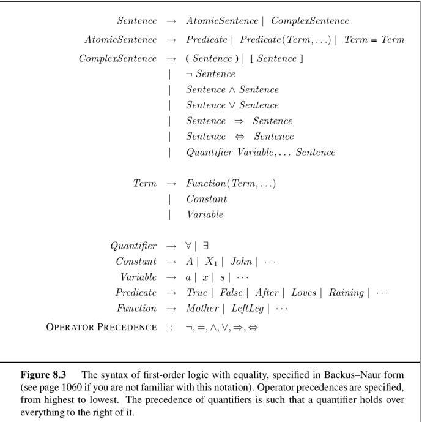
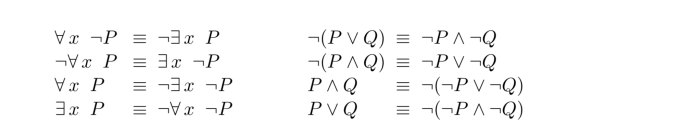
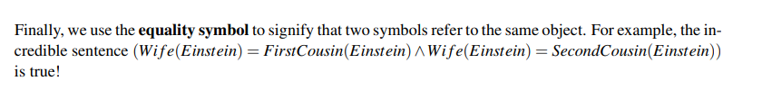

# First-Order Logic (FOL)

**FOL** is more expressive than propositional logic and uses objects as its basic components. We can use FOL to describe relationships between objects and apply functions to them. Each object is represented by a **constant symbol**, each relationship by a **predicate symbol** and each function by a **function symbol**.

## FOL Table

## Use Cases

- Functions: Don't want to have a bunch of constant symbols, so can use functions.
    - ex. To refer to John's left leg and Richard's left leg we can use **function symbols**
        - Leftleg(John)
        - Leftleg(Richard)
- Atomic Sentences: descriptions of relationships between objects, connected by logical connectives
    - ex. To say that John and Richard are brothers
        - Brother(John, Richard)
- Complex Sentences: analogous to those in propositional logic

## De Morgan's laws

## lol

## FOL vs Propositional Logic (PL)

- PL: assignment of true or false to all proposition symbols
    - Represent world as a vector, with `1` or `0` for every symbol. Binary view of world is a **factored representation**
- FOL: mapping of all constant symbols to objects, predicate symbols to relations between objects, and function symbols to functions of objects. 
    - Sentence is true under model if relations described by sentence are true
    - Could have an infinite number of models
    - Represent world as objects that relate to each other. Second object-oriented view of the world is known as a **structured representation**

## FOL Inference
