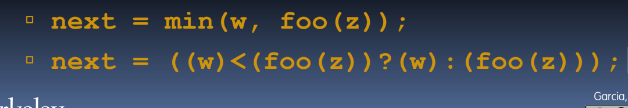

# Introduction to the C Programming Language

## Get Book -> `The C Programming Language` by `Kernighan and Ritchie`

# Compilation 


1. Take source code
2. Compile it, make architecture specific code (can't take compiled program to diff machine)
3. Take source code, compile it into .o files, and then link to executables


Benefits

1. Runtime performance
2. parallel compiles

Cons

1. can't port it very well (ex. game for intel won't work for mac)
2. "Change -> Compile -> Run [repeat]" iteration cycle can be slow during development

`make -j` compiles in parallel

linker is sequence -> Amdahl's Law

### C Pre-Processor (CPP)


- include "" -> local
- include <> -> system library
- define PI (3.14) -> define constant
- #if/#endif -> conditionally include text

#### Macros

- #define ... -> string replacement
###### side effects


- condition ? true : false; ternary
- put parantheses around entire expression

# C vs Java 


# Update to ANSI C

- `gcc -std=c99` to compile
- Declarations in `for` loops
- variable-length non-global arrays 
- `<inttypes.h>` explicit integer types
- `<stdbool.h>` for boolean logic definitions

# Update to C99

- `gcc -std=c11`
- Multi threading support!
- Unicode support
- removal of `gets()` security issue

# C Syntax: main

`int main (int argc, char *argv[])`

- `argc` contains number of strings in command line
    - `argc` is 2, `unix% sort myFile`
    - why do you need to know the name of the function `sort`
        - hint: "What if there is an error?"
        - ans. In usage case, something went wrong, often want to tell user what call they should have made, user could have renamed executable to `foobar`, so pass in file to work

- `argv` pointer at an array containing the arg as strings


### Booleans

- `0` 
- `NULL` 
-> `stdbool.h` 

##### True

- Anything that is not False

#### Typed Variables


#### Integers difference


#### Constants

`const ___ = ___`

#### Enums

Group of related integer components

[add exmaple]

### Typed Functions in C

- need to declare type of data to return
- `return void` -> `return (Python)`

### Structs

Abstract Data Types

#### Typedef

`typedef uint8_t BYTE;`
`BYTE b1, b2;`

Structs are structured groups of variables

```
typedef struct {
    int length;
    int year;
} SONG;

SONG song1;
song1.length = 213
song1.year = 1994
```

### Control Flow

- if-else
    - `if (x == 0) y++;`
    - `if (x ==0) (y++; j = j + y;)`

similar to java lol

### Compute Sines Table


### Variable Declarations

- variables are garbage (don't trust it)
- lot of undefined bugs `Heisenbugs` (hard to reproduce)


