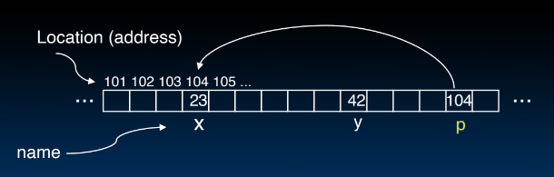
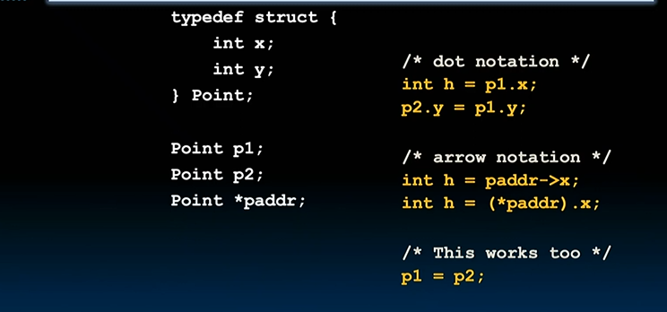
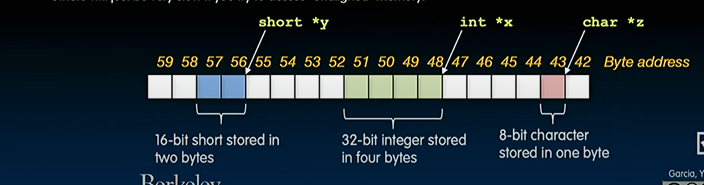
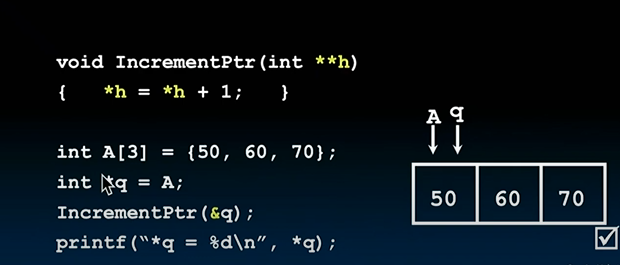

# C Pointers, Arrays, and Strings

### Address vs Value

#### Memory

- Each cell of the array has an address associated with it
- Each cell stores value
- `8Fs`
- $2^{32}$ diff bites
- unsigned numbers, just go from `0` to some max value

#### Address

- refers to a memory location with the value stored in the location
- like an index

### Pointers

A variable that contains the address of a variable



- `p` is also in memory that has contains the address 104 and points to that memory location

#### Pointer Syntax

`int *p;` - tells compiler that **variable p is address** of an `int`

`p = &y;` - tells compiler to assign **address of `y`** to `p`

`z = *p;` - tells compiler to assign **value at address in `p`** to `z`, `*` called the "dereference operator" in this context

#### Pointer Example

```C
// How to create pointer, initialized with garbage, 4 bytes wide
int *p, x;
// setting x to 3
x = 3;
// set p to address of x
p = &x;
// get value p points to
printf("p points to %d\n", *p);

// How to change a variable pointed to, also can say x = 5
*p = 5;

```

#### Pointer and Parameter Passing (1/2)

`C` passes in parameters by value

```C
void addOne (int x) {
    x = x + 1
}
int y = 3
addOne(y); // y is still 3

```

#### Pointer and Parameter Passing (2/2)

How do we get function to change value?

```C
void addOne (int *p) {
    *p = *p + 1;
}
int y = 3;
// pass in pointer to y
addOne(&y);
// y = 4
```

### C Pointer Dangers

- Declaring a pointer just allocates space to hold pointer - does not allocate something be pointed to
- **Local variables in C are not initialized**, they may contain anything
```C
void f()
{
    int *ptr;
    *ptr = 5;
}
// stuffing 5 somewhere into memory since *ptr is initialized to somewhere in garbage, corrupted memory
```

#### Why use Pointers

If we want to pass a large `struct` or array, it is faster/easier to pass a pointer, otherwise would have to cop huge amount of data

#### Drawbacks of Pointers

Pointers are the single largest source of bugs in `C`

### Using Pointers Effectively

- Pointers point to any data type (`int`, `char`, `struct`)
- `void *` is a type that point to anything, harder to debug
- Pointers to functions
```C
int (*fn) (void *, void *) = &foo
// call function
(*fn) (x, y)
```

### Pointers and Structures


### NULL pointers
- Reset pointer to sentinel value `0`
- If you write or read a null pointer, program should crash
- "0 is false" -> `if !p` (P is a null pointer) or `if(q)` (Q is not a null pointer)

### Pointing to different size objects


- "word alignment": stored on 32b or 4-byte boundaries

### Arrays 

```C
// Declaring array
int ar[2];

// Declaring and init
int ar[] - {795, 635};
;
// Accessing elements
ar[num]

// Arrays are (almost identical to pointers), an array variable is "pointer" to a first value
char *string
char string[]

// same
ar[0]
*ar

ar[2]
*(ar+2)

// Declared arrays are only allocated while the scope is valid
char *foo() {
    char string[32]; ...;
    return string;
} 
// function that returns pointer to character array
// moment procedure returns, don't have access to that procedure
// end up pointing to an area that we shouldn't be pointing to


// Right
int ARRAY_SIZE = 10
int i, a[ARRAY_SIZE];
for (i = 0; i < ARRAY_SIZE; i++){ ... }
// single source of truth
```

#### Pitfall

An array in C does not know it's own length, need to pass in array and length

#### Pointer Arithmetic
- `pointer + n` Adds `n*sizeof("whatever pointer is pointing to") to the memory address`
- `pointer - n` Subtracts `n*sizeof("whatever pointer is pointing to") to the memory address`

### Pointer Question




