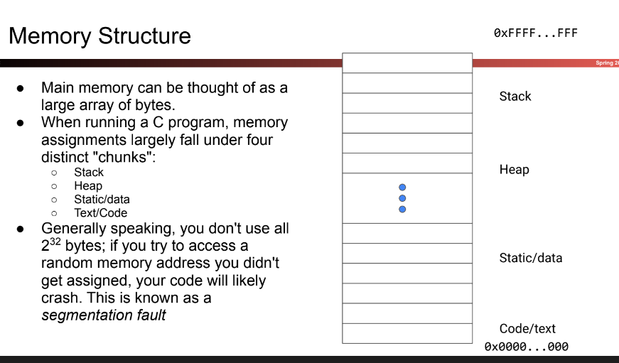
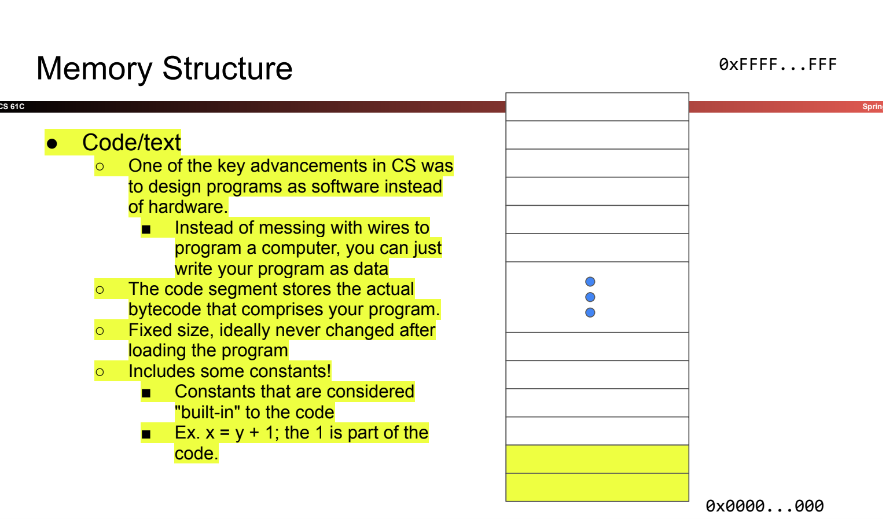
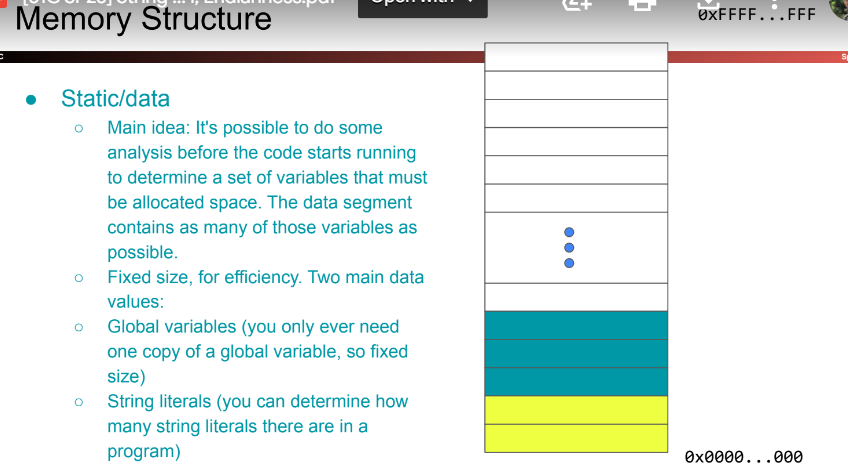
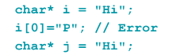
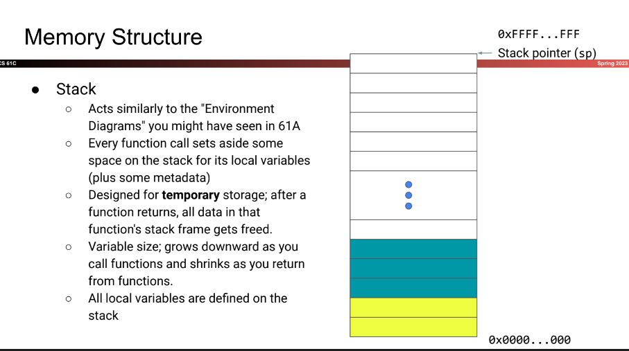
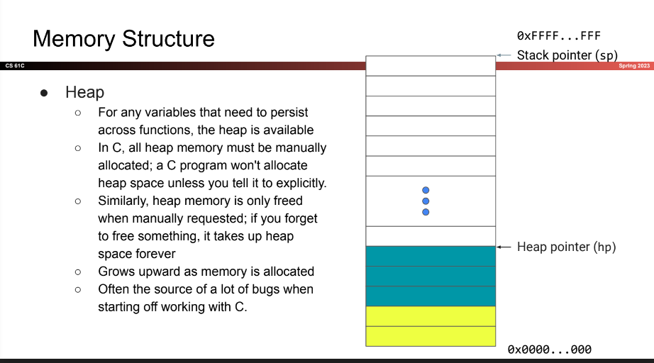
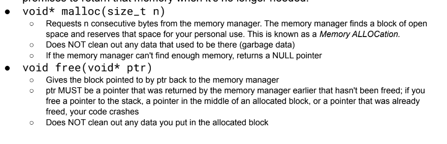
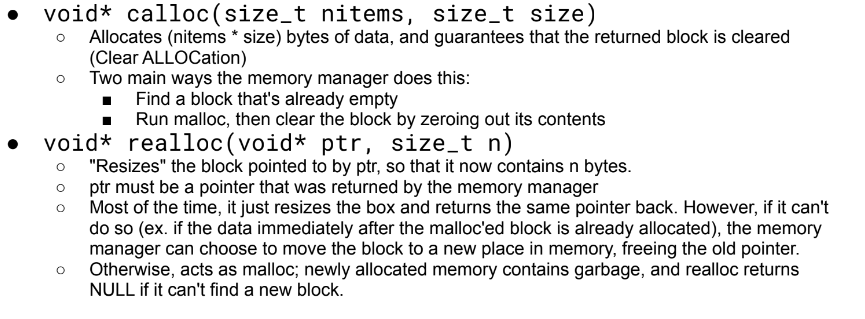
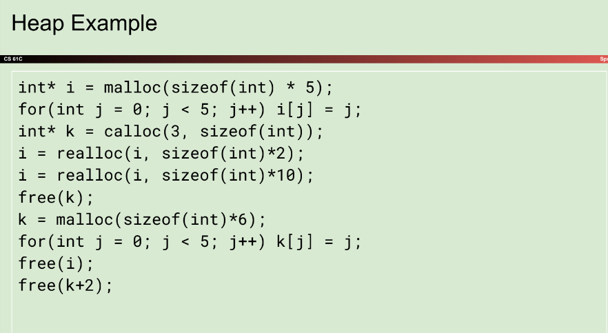
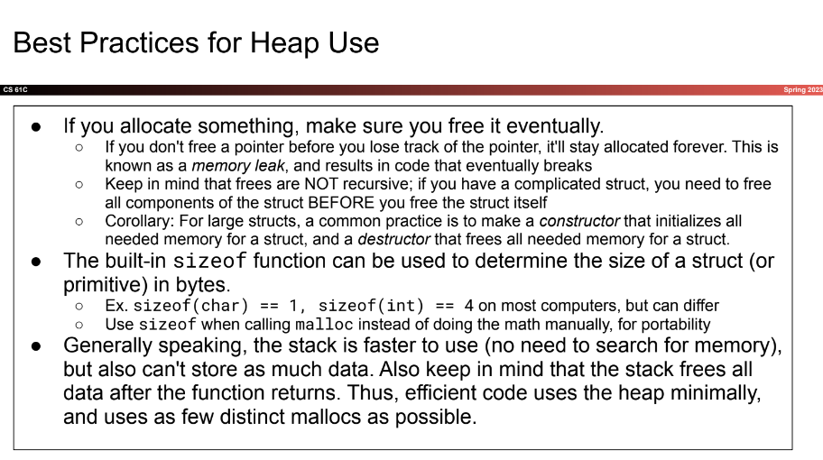

# Strings, C Memory Model, Endianness

# Strings

- Strings in `C` are defined as arrays of characters, similar to `python`
- C arrays don't store how long they are
- Special character `NUL` (ASCII value 0, written as `\0`)

- String "HI" -> `{'H', 'i', '\0'}` could also be `{72, 105, 0}`
- strings will have one more byte of memory
- NEED TO ADD NULL TERMINATOR, `C` will be looking for that byte (nom, nom, nom, where my `0` at)

# C Memory Model

- store memory in distinct chunks
    - Stack
    - Heap
    - Static/data
    - Text/Code

- Store actual bytecode that represents your program
- Include some constants
    - ex. `x = y + 1`

- analysis before code running
- Global variables
- String Literals
    - every unique string stored here, point to same memory address
    - String literals are immutable (can't change them) if they are stored in data

    - only applies to string literals which need pointers
    - character array is same as integer literal

- local variables
- pointers themselves (not what they point to)
- growing downwards (add new block to stack) [top -> down: main -> foo()]

- enormous blob of memory
- need to manually specify using data in heap
- also need to say that we are done with data
- source of a lot of bugs

# Heap Usage
- run by memory manager, keeps track of size correlative to pointer, but don't have access to it
- program needs to request memory from the os, and promises to return that memory when no longer needer

1. Stack holds variables, `i, j, k`
2. first line, holds memory for five integers
3. `i` points to A (2.)
3. fill up array with `[0, 1, 2, 3, 4]`, store some space in beginning for how long array is
4. I got lost lol

