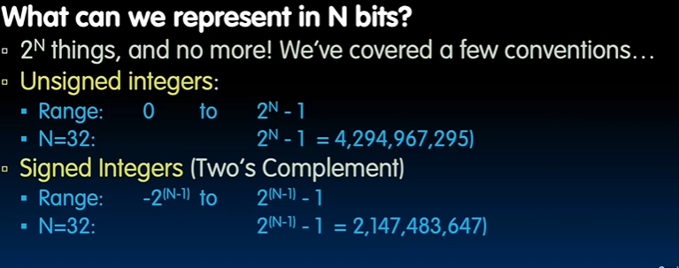
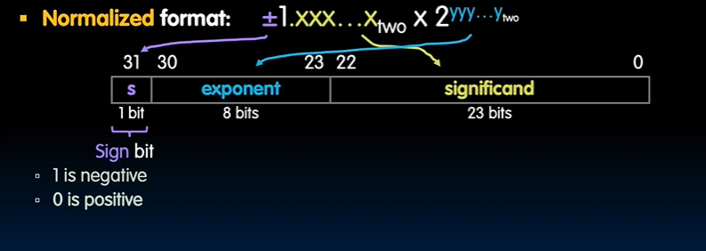

# Floating Pointer

## Review of Integer Number representations

## Integer and Fraction

### Naive

### Scientific Notation

$1.640625 * 10^{-1}$

- after decimal point is **mantissa**
- exponent (-1) is **exponent**

- "Normalized form"
    - no leading 0s, exactly one nonzero digit to the left of the point
    - $3.0 * 10^{-9}$
    - all normalized numbers have leading 1

- Exponent field uses "bias notation"
    - Subtract 127 from exponent field to get exponent value
