# Endianness, Floating Point Numbers

# Endianness

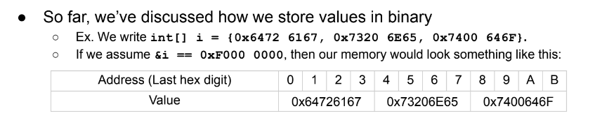

- what happens if we do `((char*) i) [2]`
    - treat i as `char` array, go to second hex byte

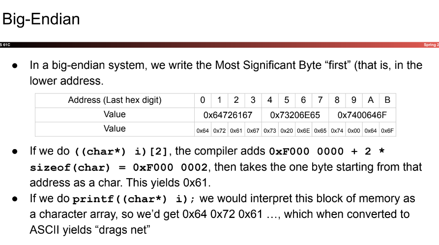

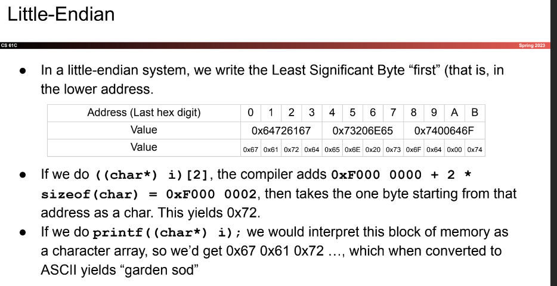

In either case, reading integer yields same result

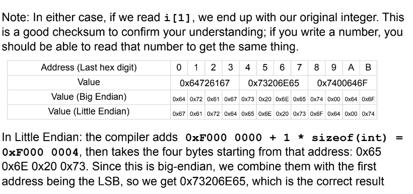

- in reality, only flipping to store
- all endiannesses work as long as you are consistent
- C doesn't like converting integers into character arrays
- Big Endian is commonly used in networks (communicating data between networks)
- Little Endian is commonly used within the computer

# Floating Point
- encoding scheme to store arbitrary real numbers
- starts off with a simple structure
    - store relevant values
    - relatively simple circuitry
- start to optimize and becomes complex
    - Denorms, Infinities, Nans

## Goals: What number's do we want to store?
- need to handle:
    - really big numbers (ex. Avogadros' number)
    - really small numbers (ex. Planck's constant)
- Observation:
    - dealing with large numbers, don't care about small absolute differences
- Goal:
    - store number that's accurate within .001%

## Scientific Notation
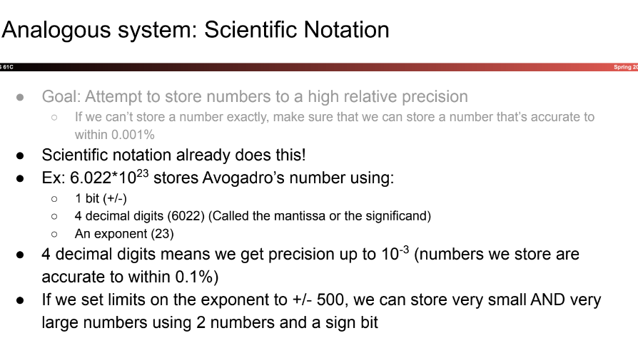

## Floating Point System: V0

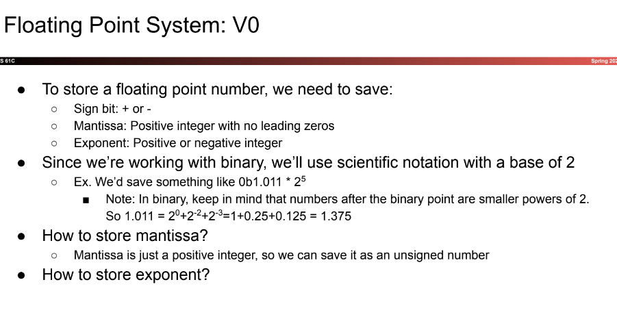

- store exponent with bias encoding in the order sign-exponent-mantissa
- set to $-(2^{n-1}-1)$

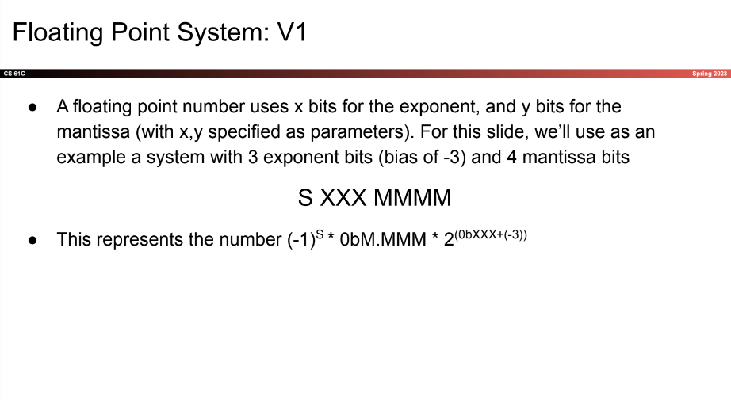

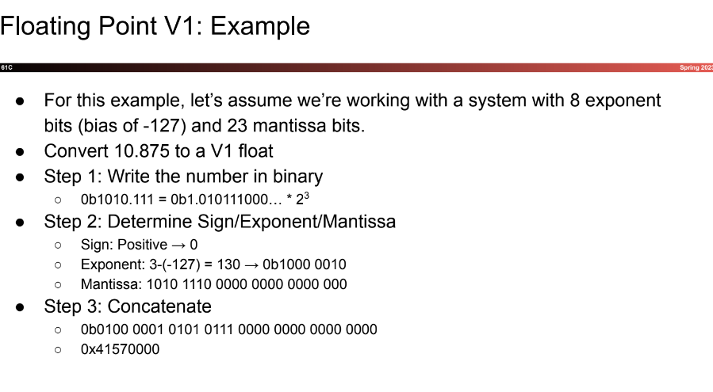

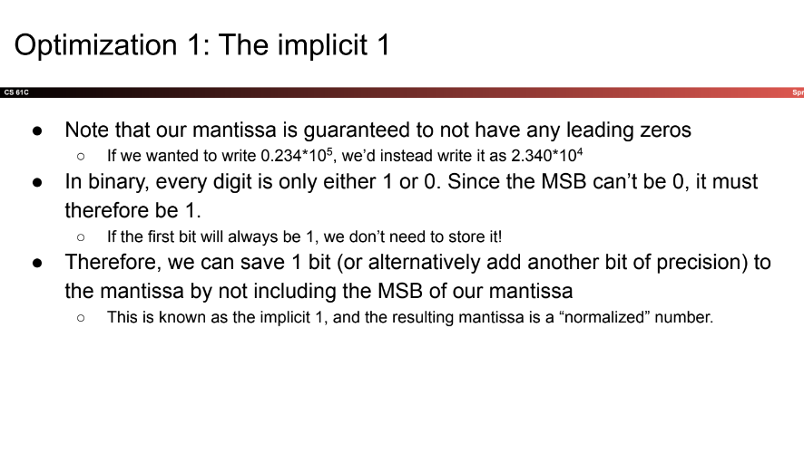

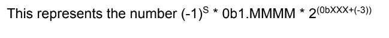

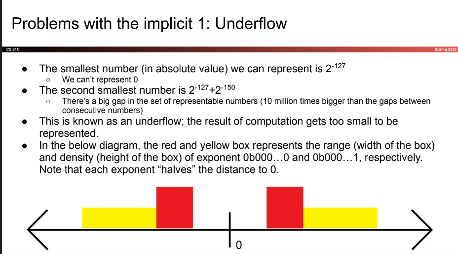

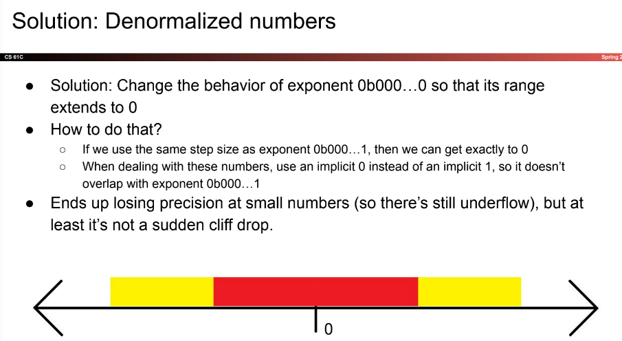

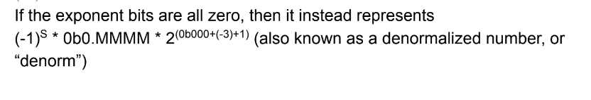

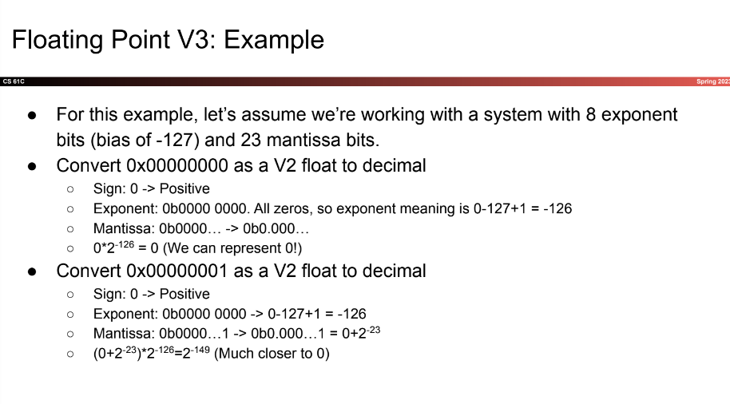

## Optimization 2: Dealing with infinity, division by zero

- can still exceed maximum float
- want to include "1/0"

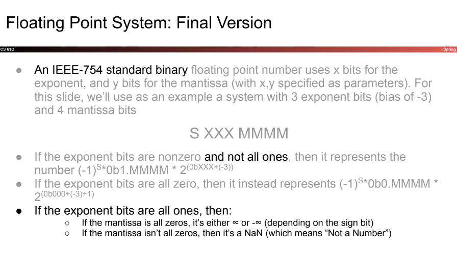

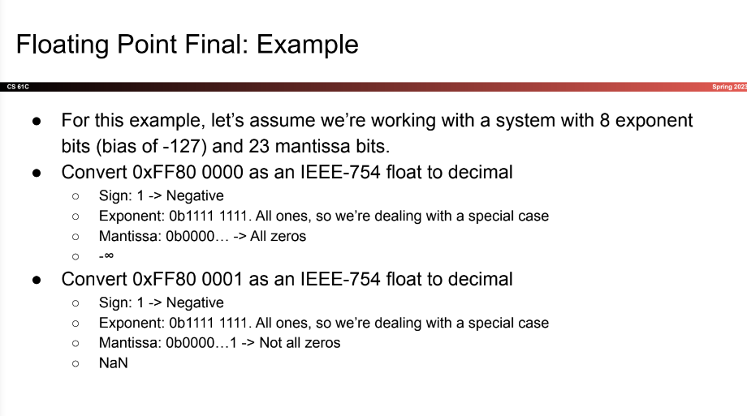

