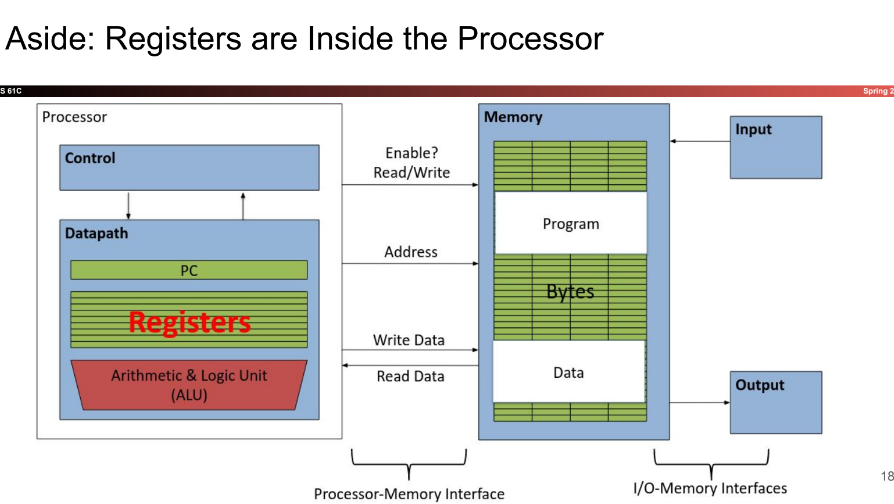
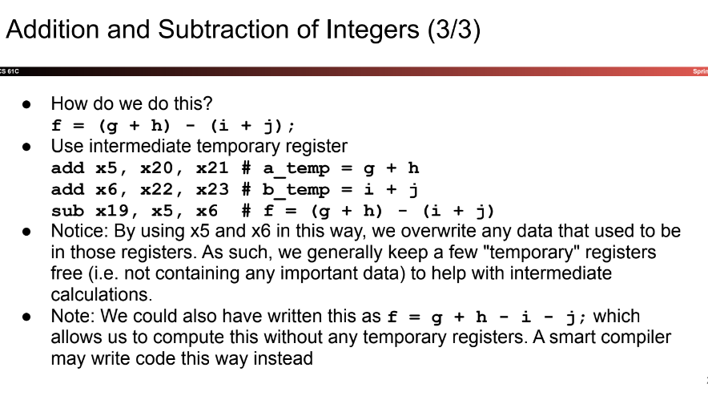
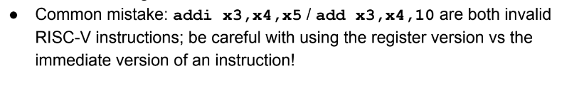

# RISC-V Part 1

## Overarching view of RISC-V

- A RISC-V system is composed of two mains parts
    - The CPU (responsible for computing)
    - Main memory, responsible for long-term data storage
- CPU is v fast (one instruction ~ 1 nanosecond)
- Going to main memory takes hundred or even thousands of times longer
- CPU can store small amount of memory through components called registers

## Registers
- Definition: CPU component designed to store small amt of data
- each register stores 32 bits of data (32-bit system) or 64 bits of data (64-bit system), will only be considering **32 bits** in this class
- data is purely binary, types do not exist, programmer needs to keep track of registers and their purpose
- RISC-V gives access to 32 integer registers

- numbered from $0$ to $31$
    - referred to by number: `x0` - `x31`
- register `x0` is special and always stores `0`. only have 31 registers
    - registers are identical in behavior, only diff is conventions used when using them

### Instructions

- Each line of RISC-V code is a single instruction, which executes a simple operation on registers.
- Format:
    - `<instruction name> <destination register> <operands>`
    - ex. `add x5 x6 x7`
        - add values stored in x6 and x7, and store in x5
- Comments -> `#`
- COMMENT YO CODE BOY 

### Addition and Subtraction

#### 1

- Addition in Assembly
- `add x1, x2, x3` (RISC-V) <-> `a = b + c` (C)
- `sub x3, x4, x5` (RISC-V) <-> `d = e - f` (C)

#### 2

- How to do: `a = b + c + d - e`
- Break into multiple instructions
    - `add x10, x1, x2 # a_temp = b + c`
    - `add x10, x10, x3 # a_temp = a_temp + d`
    - `sub x10, x10, x4 # a = a_temp - e`
- single line of C might be broken down into multiple lines
- hash mark is ignored

#### 3

### Immediate

- Immediate are numerical constants
- appear often in code, have special instructions
- `addi x3, x4, 10` (RISC-V) <-> `f = g + 10` (C) 

- no subtract immediate, can just do `-X` with `addi`

### Register Zero
- appears v often
- `x0` hardwired to `0`
- `add x3, x4, x0` (RISC-V) <-> `f=g` (C)
- `add x0, x3, x4` will not do anything

