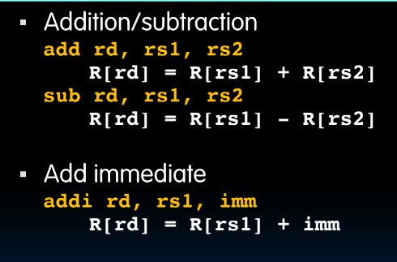
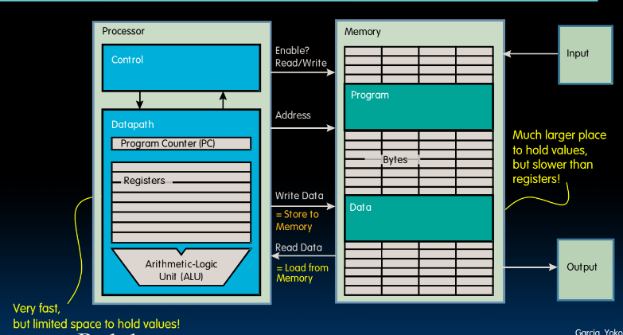
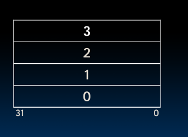
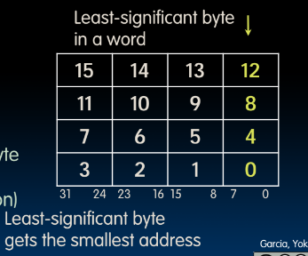
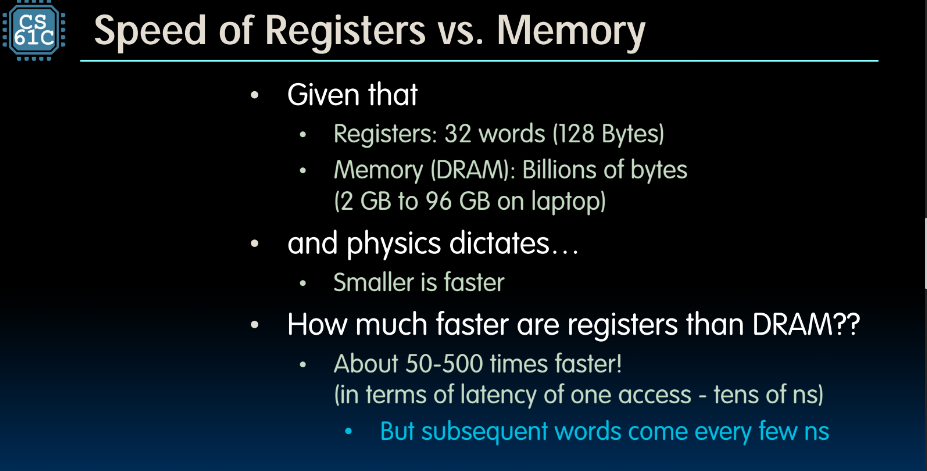
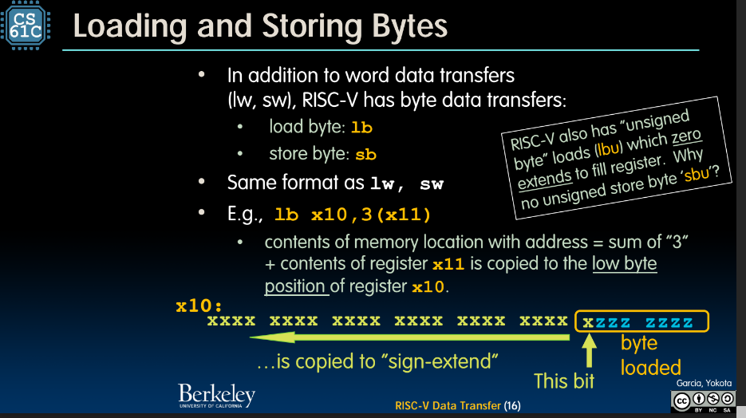

# RISC-V Data Transfer



## Storing Data in Memory

### Data Transfer: **Load from** and **Store to** memory



## Memory Addresses are in Bytes

- Data typically smaller than 32 bits, but rarely smaller than 8
- 8 bit chunk is called a byte
- memory addresses are really in bytes, not words
- word addresses are 4 bytes apart
    - word address is same as as address of rightmost byte- ls byte (little-endian)





## Data Transfer Instructions



## Load from Memory to Reigster

```C
int A[100];
g = h + A[3];
// <- Data flow
```
Load Word (lw) in RISC-V:
```RISC-V
lw x10, x12 (x15) # Regx10 gets A[3]
add x11, x12, x10 # g = h + A[3]
```

Store Word (lw) in RISC-V:
```RISC-V
lw x10, x12 (x15) # Reg x10 gets A[3]
add x10, x12, x10 # Temp reg x10 gets h + A[3]
sw x10, 40, (x15) # A[10] = h + A[3]
```

- Note 
    - x15 - base register (points to A[0])
    - 12 - offset in bytes
    - Offset must be a constant known at assembly time

## Loading and Storing Bytes


