# RISC-V Decision Making and Logical Operators

## Review 
- Memory is byte-addressable, but `lw` and `sw` access one word at a time
- Pointer (used by `lw` and `sw`) is just a memory address, can add and subtract to it (w/ offset)
- Big vs Little Endian
    - draw lowest byte on the right
- New Instructions:
    - `lw, sw, lb, sb, lbu`
- don't need to expand when storing (no `sbu`)

## RV32 so far

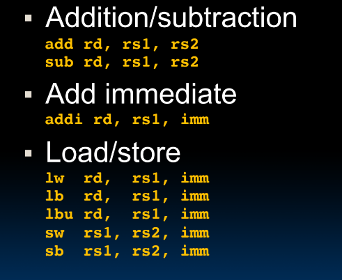

## Computer Decision Making

- Based on computation, do something different
- `if` statements
    - `beq reg1, reg2, L1`
    - go to statement labeled `L1 if (value in reg1) == (value in reg2)`
    - ...otherwise, go to next statement
    - `beq` stands for *branch if equal* (`if`)
    - Other instruction: `bne` for *branch if not equal* (`else`)

## Types of Branches

- Branch - change of control flow
    - `beq` -> if equal
    - `bne` -> if not equal
    - `blt` -> if less than
    - `bge` -> if greater than
    - unsigned versions (`bltu`, `bgeu`)
- Unconditional Branch - always branch
    - `j` -> jump 
        - `j label`
## Example *if-else* statement

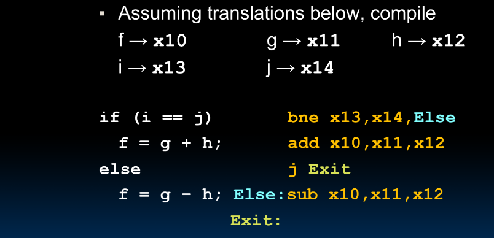

#### Take away

- might need to negate conditions to show equality (C: `i == j`, RV: `bne x__, x__`)

## Magnitude Compares in RISC-V

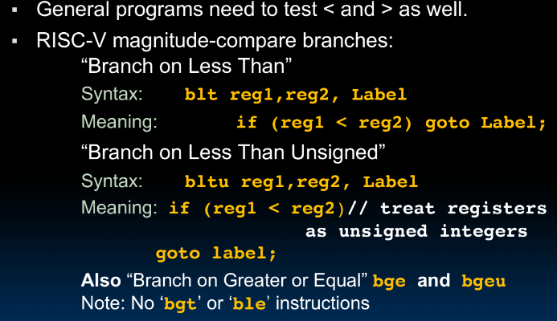

## Loops in C/Assembly

- three types
    - `while`
    - `do ... while`
    - `for`
- each can be written as either of the other two, so same branching method can be applies to loops
- **Key**: Though there are multiple ways of writing a loop in RISC-V, the key to decision-making is conditional branch

## C Loop Mapped to RISC-V Assembly

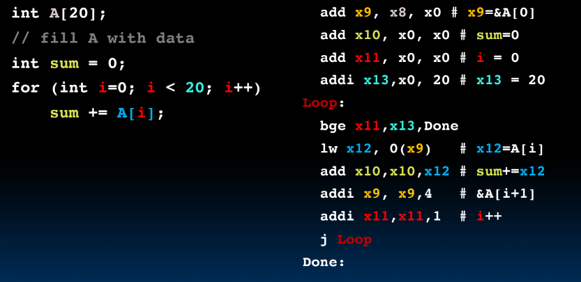

- steps
    1. get pointer to array in memory
    2. init sum
    3. get `i` counter
    4. get length (20)
    5. loop

## Logical Instructions

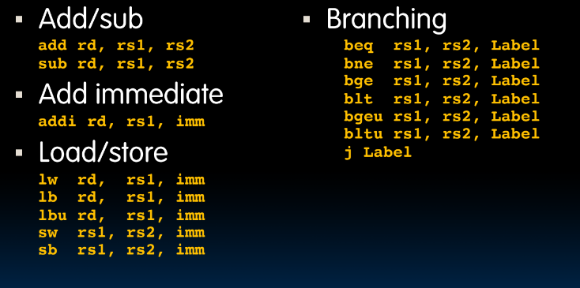

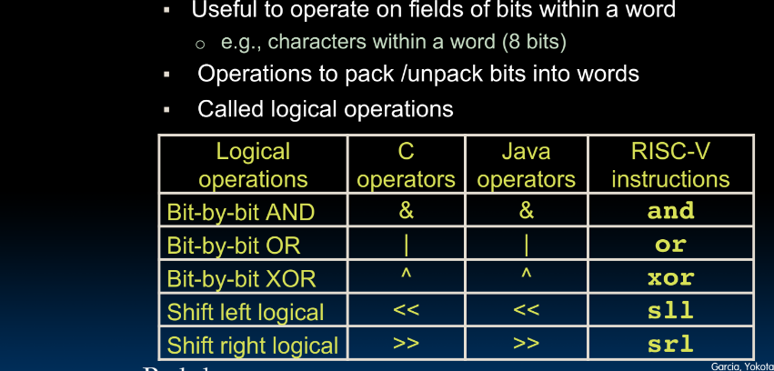

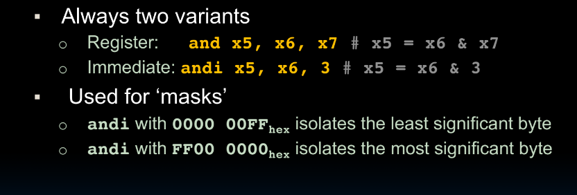

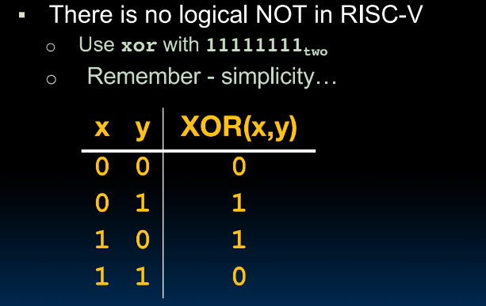

## Logical Shifting

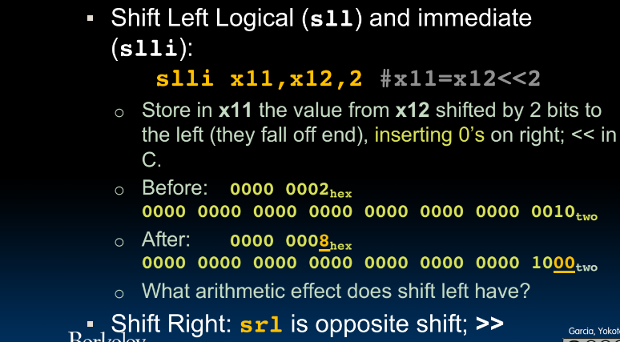

## Arithmetic Shifting

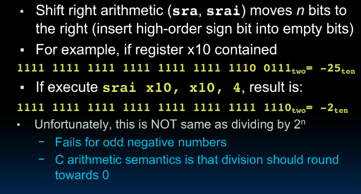

## Helpful RISC-V Assembler Features

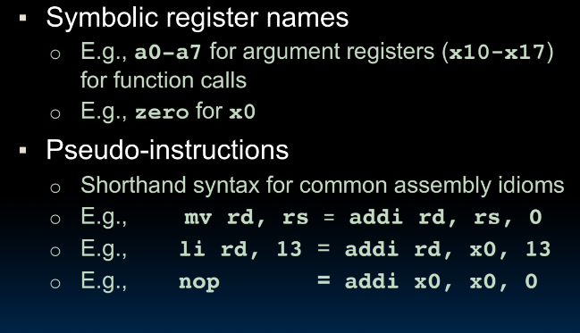
