# RISC-V Procedures

## C Functions

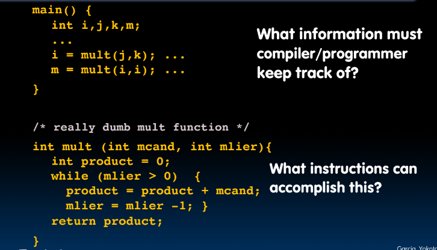

## Six Fundamental Steps in Calling a Function

1. Put **arguments** in a place where function can access them (put in registers, `a` is saved for arguments)
2. Transfer control to function
3. Acquire (local) storage resources needed for function
4. Perform desired task of the function
5. Put **return value** in a place where calling code can access it and restore any registers you used; release local storage
6. Return control to point of origin, since a function can be called from several points in a program

## RISC-V Function call Conventions
- Registers are fast
- `a0 - a7` (x10 - x17): eight **argument** registers to pass parameters and two return values (`a0-a1`) (need two registers in case we have more than 32 bits ex. `type -> double`)
- `ra`: one **return address** register to return to the point of origin (`x1`) (might be a problem if `f` calls `g` calls `e`, `e` stores pointer to `f`, but needs to point to `g`)
- Also `s0-s1 (x8-x9)` and `s2-s11 (x18-x27)`: saved registers

## Instruction Support for Functions

### 1

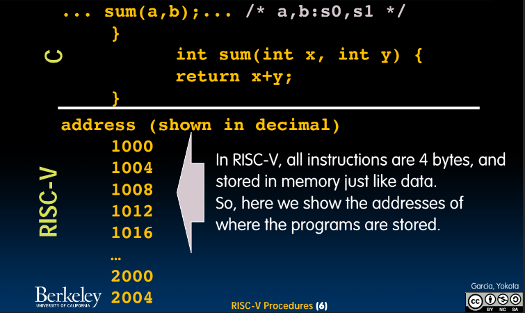
- `sum` takes two numbers and adds them
- reminder every instruction is a word wide (4 bytes)

## 2

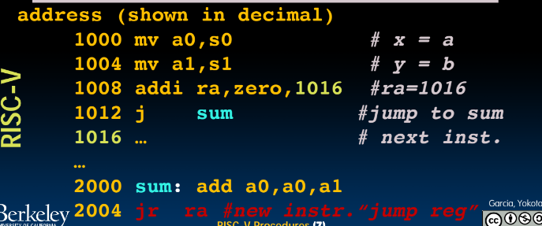
- `mv` should technically be `cp`
- store return value line after `j`
- do function at `2000` and then go back
- don't like how we hardcode address to return to and can't really do nested calls

## 3

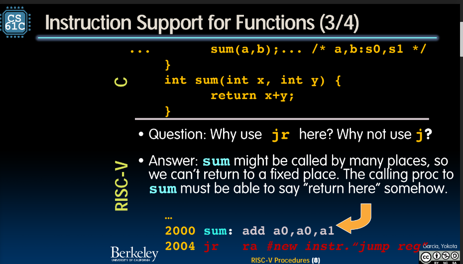

## 4

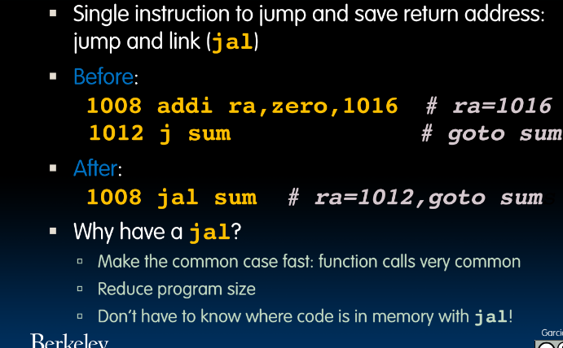
- `jal` -> jump and link, should be link and jump

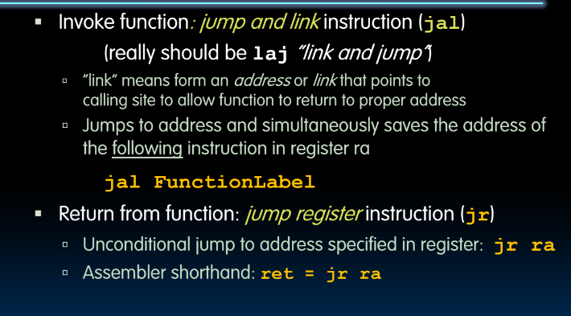3

## Summary of Instruction Support

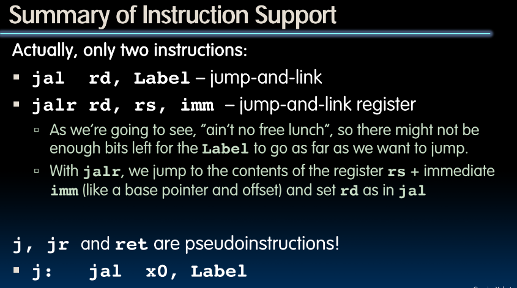

## When are Old Register Values Saved to Restore Them After Function Call?

- need a place to save old values before calling function, restore them when return, and delete
- Ideal is **stack**: last-in-first-out (LIFO) queue (e.g., stack of plates)
    - Push: placing data onto stack
    - Pop: removing data from stack
- Stack in memory, need register to point to it
- `sp` is the **stack pointer** in RISC-V (x2)
- Convention is grow stack down from high to low addresses
    - *Push* decrements `sp`, *Pop* increments `sp`

## Stack

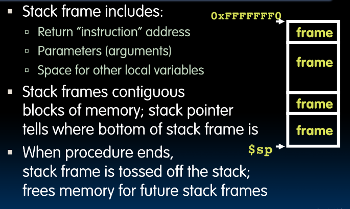

## Example

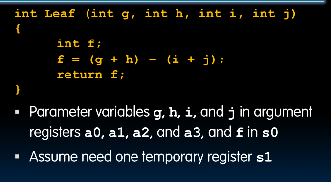

- can use special register by moving what's stored there to temporary location

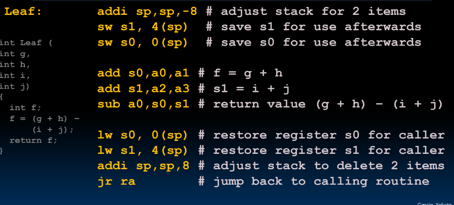

- reserve registers
- use those registers
- restore registers

## Stack before, during, and after function

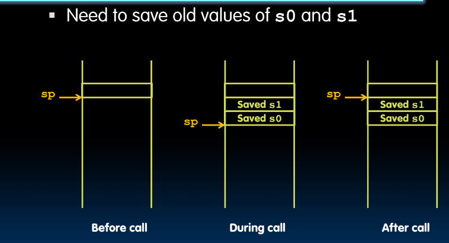

# Nested Calls and Register Conventions

## Nested Procedure

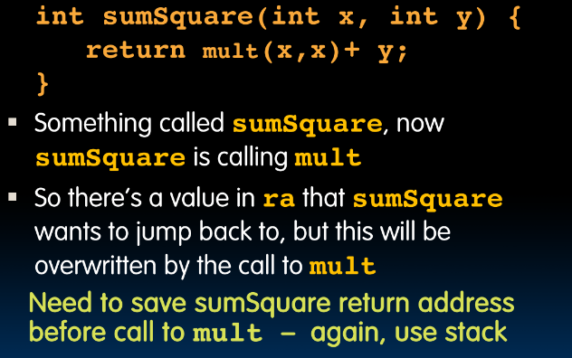

# Register Conventions

## 1

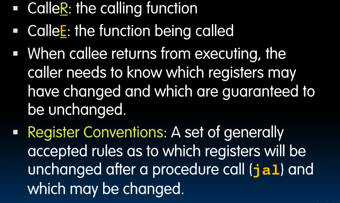

## 2

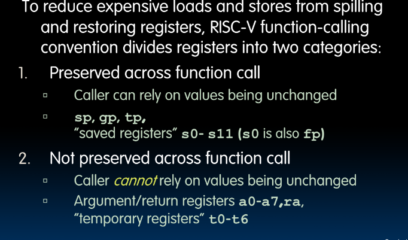

## Symbolic Register Names

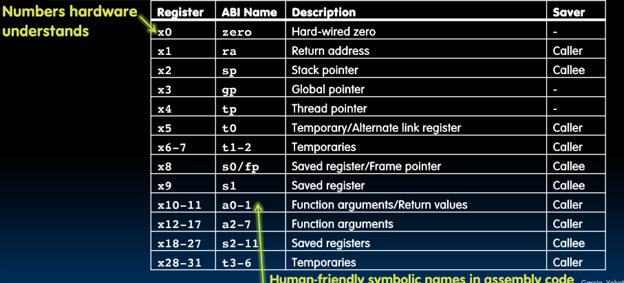

## conclusion

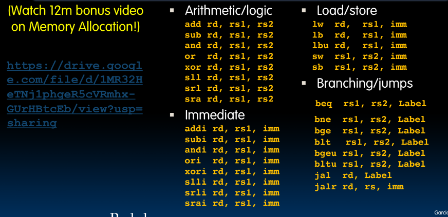

