# RISC-V Instruction Formats

# Lecture 11

## Calling Convention

- After you call a function, you should assume the following
    - all the `t` registers, `a` registers, and `ra` were set to random values
    - all `s` registers stay the same
    - `sp` is the same as before
- Before you return from a function, make sure that:
    - The `sp` and all `s` registers are back to their original value
    - `ra` is set to the value it was when you called the function (remember that `ret` is just `jr ra`!)
    - Your output is in `a0/a1`
    - Your code doesn't use the value of `t0` before setting it

## Overview

- Assembly language is useful because they can be directly translated into binary code
- RV32 -> each instruction is translation to instructions for same length (32 bits long)
- Different instructions require different values
    - "add" specifies 3 register inputs
    - "addi" specifies 2 registers and 1 immediate
- Split 32 bits into "chunks" for each component

## R-Type

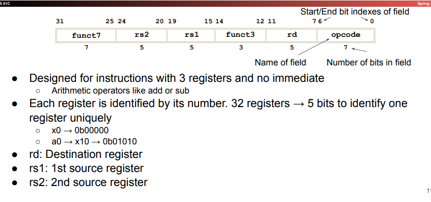

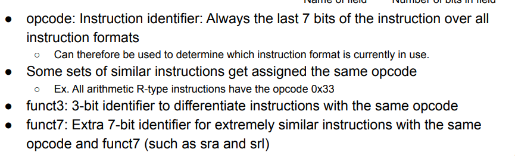

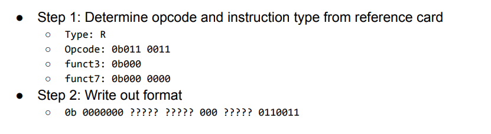

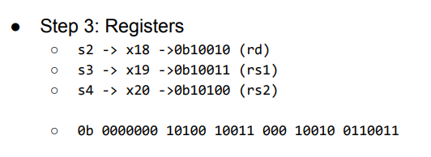

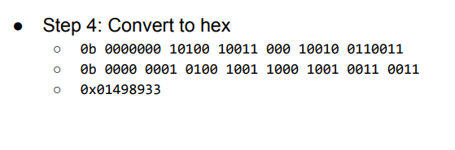

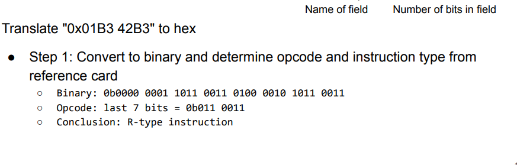

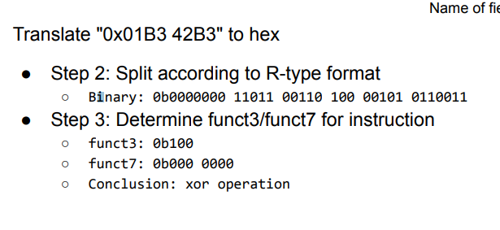

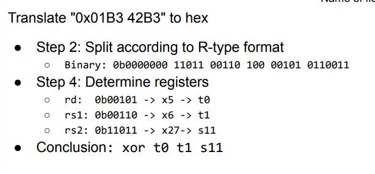

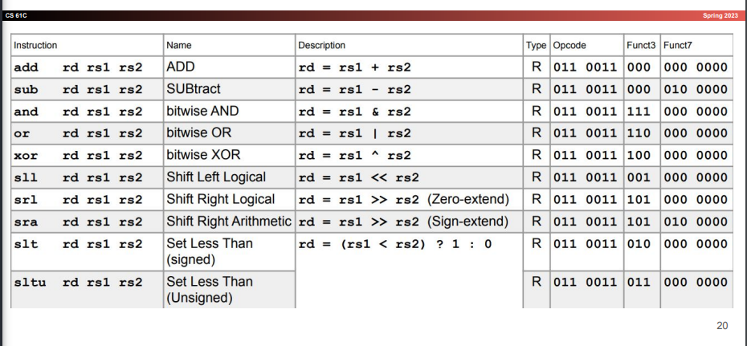

### I-Type

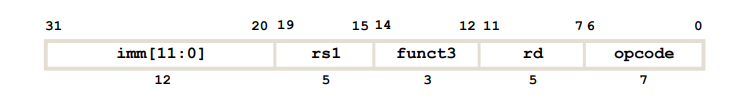

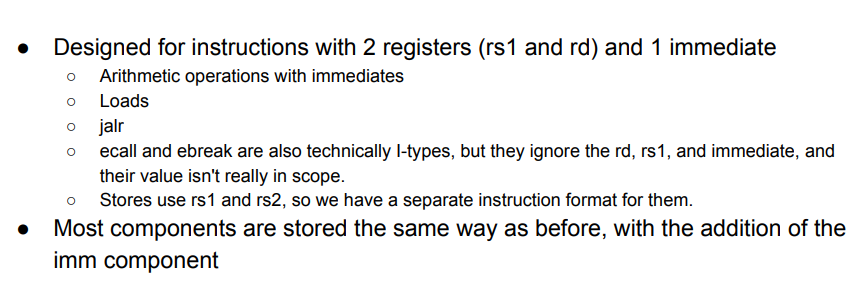

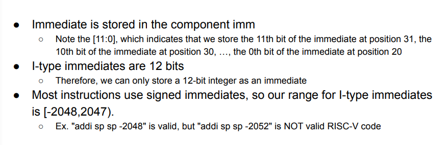

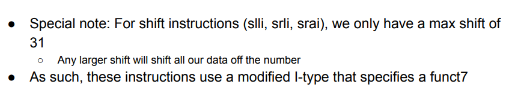

## Arithmetic Instructions

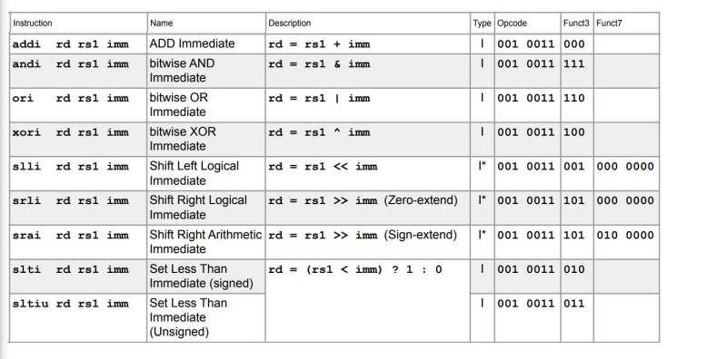

### Load and Jump Instructions

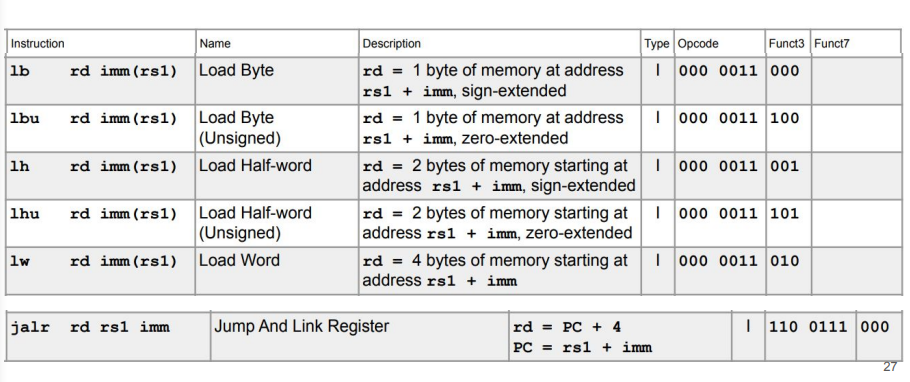

## S-Type

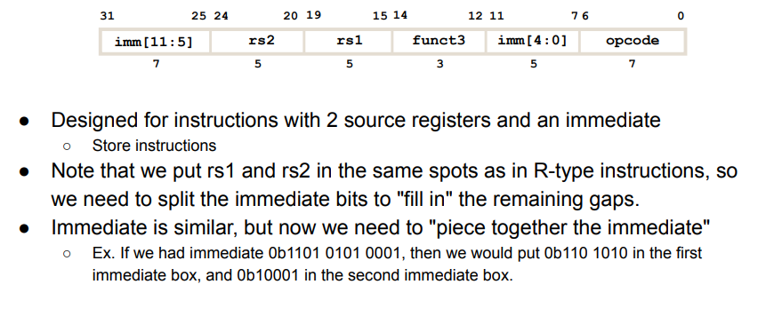

### All Instructions

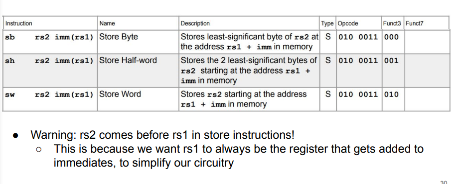
