# RISC-V Instruction Formats

## U-types

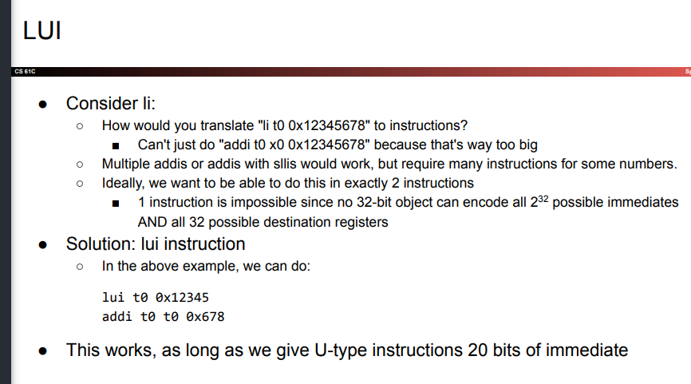 

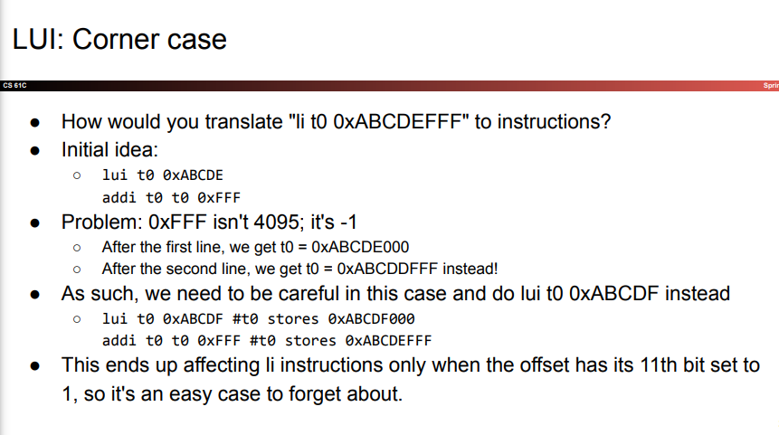

## AUPIC and Relative Addressing

- `auipc` similarly gets used primarily as a way to save an arbritrary value when used with addi
- main diff is adds result to PC
- instructions involving labels use relative addressing instead of absolute addressingA
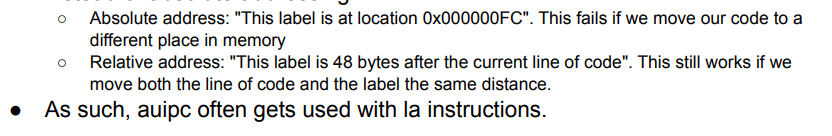

## U-Type General Instruction

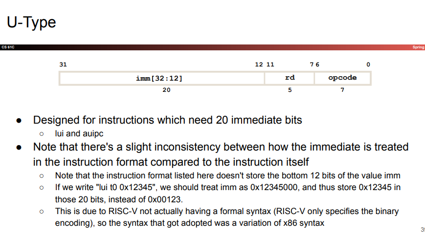

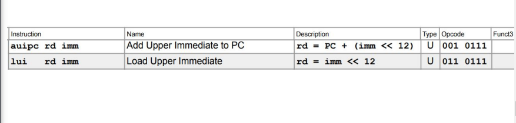

## Labels

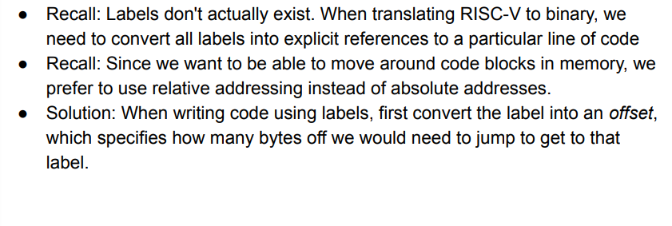

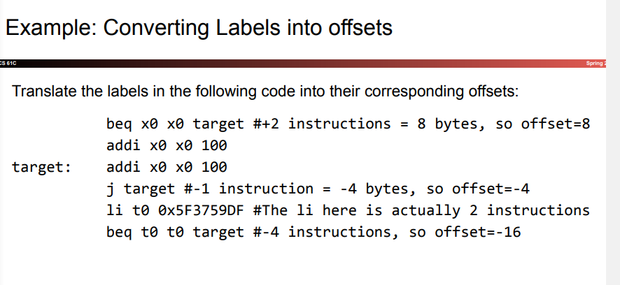

## Storing offsets

- all offsets are multiples of 4 -> each instruction takes 4 bytes of memory
- if we store immediate as a signed number, we always have last two bits 0s
- therefore, we don't store the lowest bit of an offset immediate

## B-Type

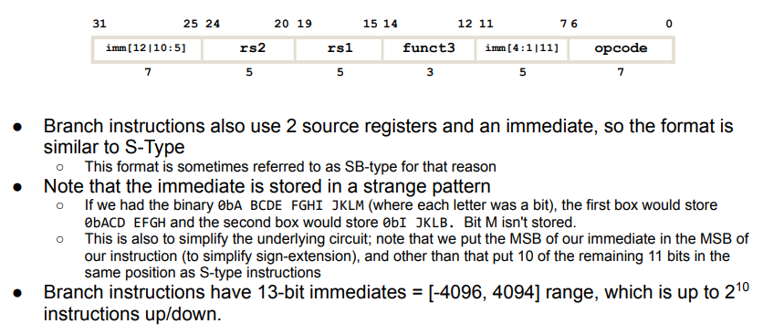
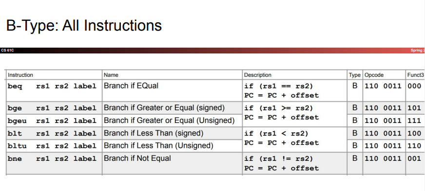

## J-Type

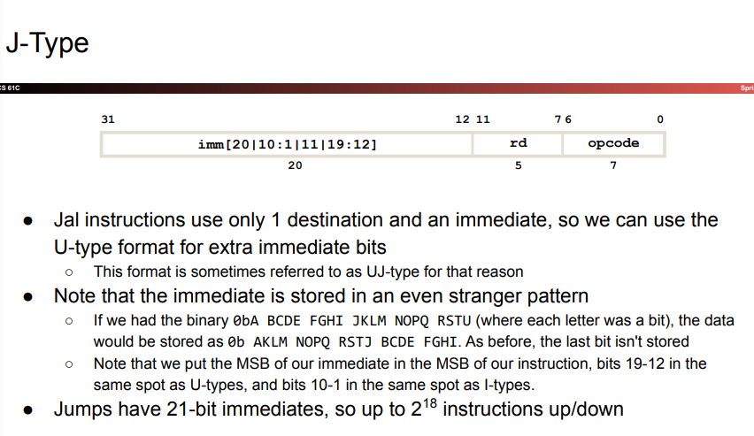
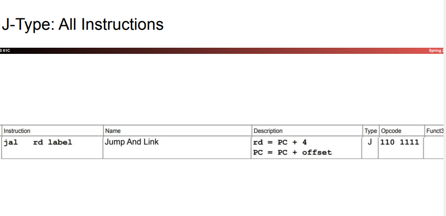

## How to handle immediate large than you can store
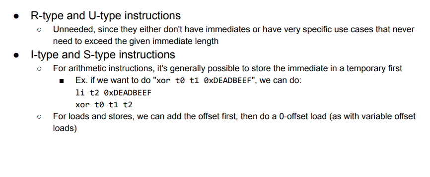
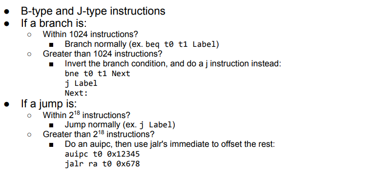
