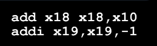

# Running a Program (Compiling, Assembling, Linking, Loading)

## Pseudo instructions

- Convenient variations of instructions understood by the assembler, but not by the machine

## How do we run a C program

- **Translator**: Converts a program from the source language to an equivalent program in another language
    - almost always mean higher efficiency, higher performance
- Contrast with **Interpreter**: Directly executes a program in the source language
    - Note: C programs/RISC-V can also be interpreted!
    - Example : Venus RISC-V simulator useful for learning/debugging

## Steps in compiling and running a C program

## Compiler

## Assembler

## Directives
- gives directions to the assembler
- often generated by the compiler
- do not produce machine instructions, rather they inform how to build diff parts of the *object file*

## Object File Format

### 1/3

1. **Object File Header**: size and position of other pieces of the object file
2. **Text Segment**: machine code
3. **Data Segment**: binary representation of static data in the source file

### Producing Machine Code

#### Simple Case
- Arithmetic, Logical, Shifts, etc.

- PC-Relative Branches and Jumps

#### Two-Pass

#### What about Other References?

### 2/3

#### Object File Format
4. **Symbol Table**: List of file's labels, static data that can be referenced by other programs
5. **Relocation Information**: Lines of code to fix later (by Linker)

#### Symbol Table
- List of "items" in the file
- Instruction **Labels**
    - Used to compute machine code for PC-relative addressing in branches, function calling, etc.
    - .global direction: labels can be reference by other files
- **Data**: anything in the **.data** section
    - Global variables may be accessed/used by other files

#### Relocation Information

### 3/3

## Object File Format

## Linker

### patching together multiple object modules

### Which Address Needs Relocating

### Which Instructions Need Relocation Editing

## Resolving References

### 1/2

- low length of each segment due to the header

### 2/2

## Static vs Dynamic Linking

## Dynamically-Linked Libraries

## Loader

## What does it do

