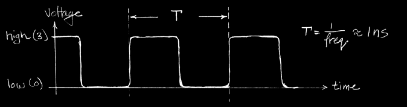

# Introduction to Synchronous Digital Systems (SDS): Switches, Transistors, Signals & Waveforms

### Machine Structures

### New-School Machine Structures

## Synchronous Digital Systems

- Hardware of a processor e.g., RISC-V is a **Synchronous Digital System**
- Synchronous
    - All operations coordinated by a central clock
    - "Heartbeat" of the system
- Digital
    - All values represented by discrete values
    - Electrical signals are treated as 1s and 0s, grouped together to form words

## Switches: Basic Element of Physical Circuit
- Implementing a simple circuit
    - close switch `A` is 1, open when `A` is 0

## Switches: (continued)
- Compose switches into more complex ones (Boolean functions):
.png)

## The Transistor
- Semiconductor device to **amplify** or **switch** signals
    - Key component in ALL modern electronics

## Transistor Networks
- Modern digital systems designed in CMOS
    - MOS: Metal-Oxide on Semiconductor
    - C for complementary: normally-open and normally-closed switches
- MOS transistors act as voltage-controlled switches

## MOS Transistors
- Three terminals: Drain, Gate, Source (Dan, Garcia, Says)
    - Switch action: 
    

## MOS Networks

- with p-type
    - voltage flows and circuit is closed if x is 0, 

## Transistor Circuit Rep. vs. Block diagram

- when a and b are closed (n type) and a and b are open (p type) it's a path from c to ground
- if either a or b are open (n type), no path to ground
- `NAND`

## Signals and Waveforms

### Clocks

- Signals
    - When **digital** is only treated as 1 or 0
    - transmitted over wires continuously
    - transmission is effectively instant
    - Implies that a wire contains 1 value at a time

- should be like bottom graph, but we get noise and delay

### Grouping

### Circuit Delay

- A / means 4 sub wires
- There will be a delay, transistor is "thinking"

### Type of Circuits
SDS are made up of two basic type of circuits
- Combinational Logic (CL) circuits
    - Our previous adder circuit is an example.
    - output is a function of the input only
    - similar to a pure mathematics, $y = f(x)$ (no side effects)
- State Elements
    - circuits that store information

# Circuits with STATE (e.g. register)

- register job is to hold values (forever, stable), like a stable parent
