# Combinational Logic

# Truth Tables

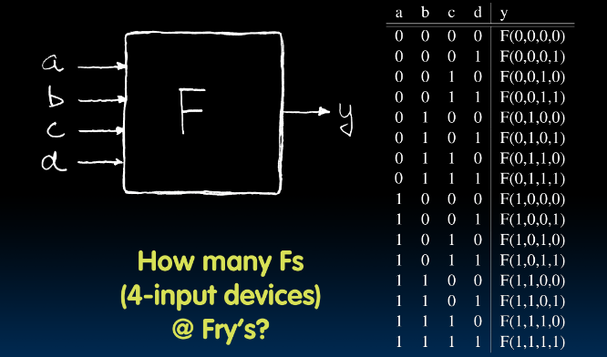
- inputs on left, outputs on right
- 4 input function on right

## TT Example #1: 1 iff one (not both) a,b = 1

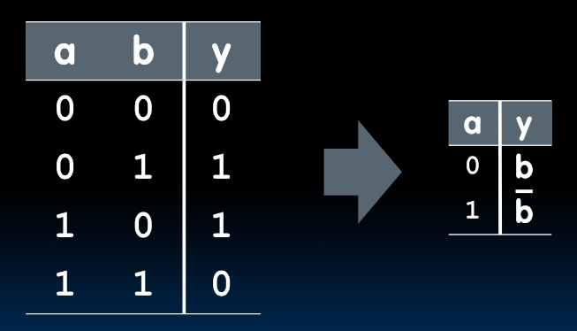

## TT Example #2: 2-bit adder

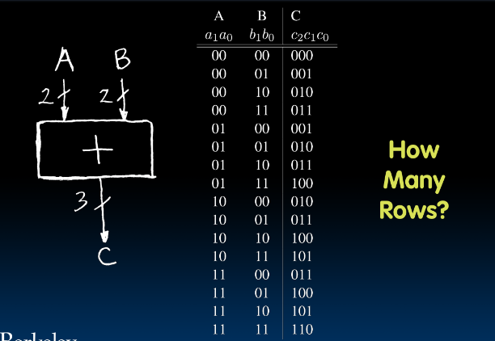

## TT Example #3: 32-bit unsigned adder

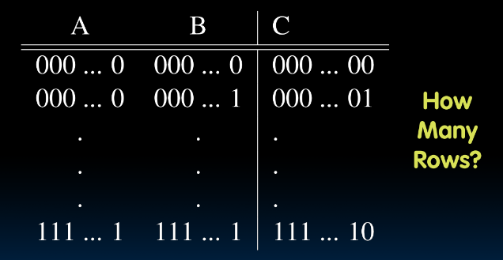

## TT Example #4: 3-input majority circuit
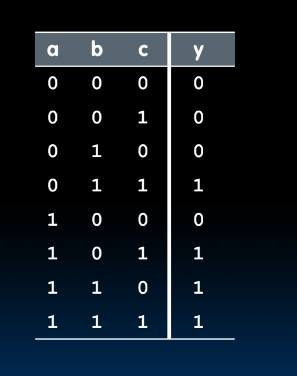
- majority of 1's and 0's

# Logic Gates

### 1/2

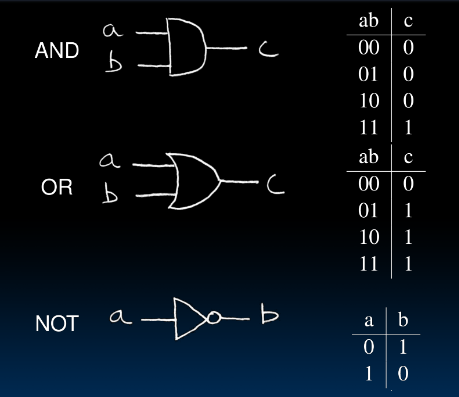

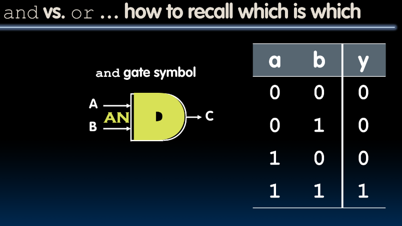

- D has a straight line

### 2/2

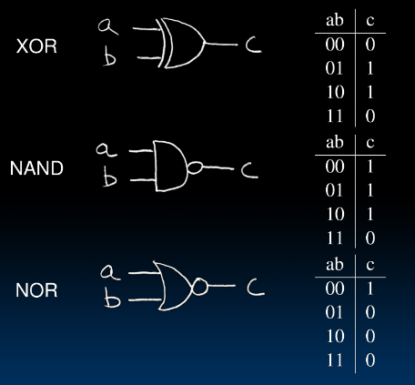
- lines for xor don't go through first curved line
- triangle means a buffer
- a == b -> `XNOR`

## 2-input gates extend to n-inputs

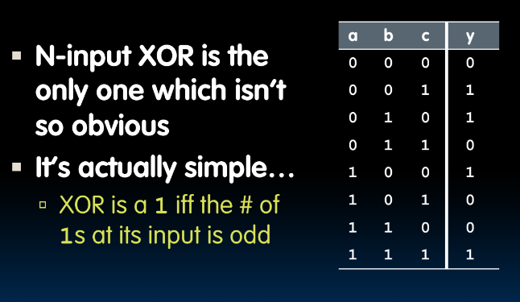

## Truth Table -> Gates (e.g., majority circuit)

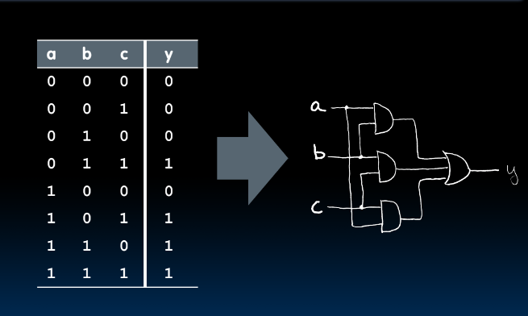

## Truth Table -> Gates (e.g., FSM  circuit)

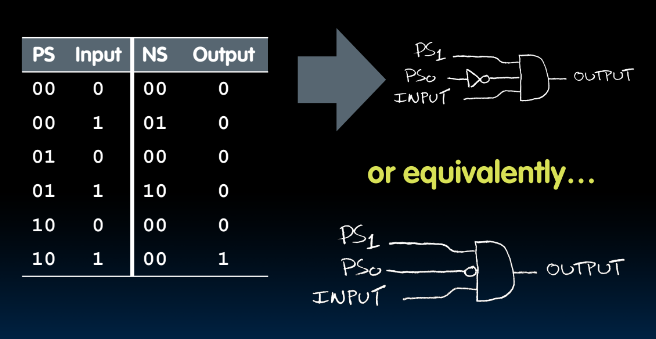

# Boolean Algebra

- Power of Boolean Algebra
    - there's a one-to-one correspondence between circuits made up of `AND`, `OR`, and `NOT` gates and equations in BA
    - `+` means `OR`, `*` means `AND`, `!x` means `NOT`

# majority fun

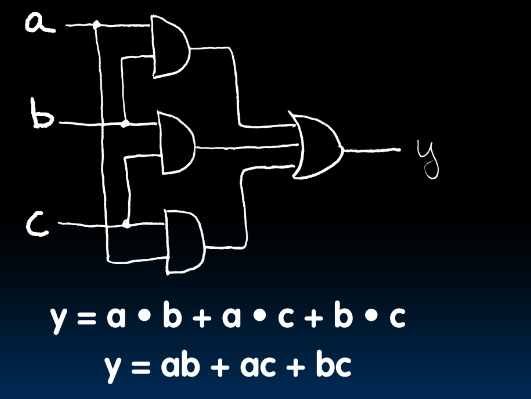

# fsm fun

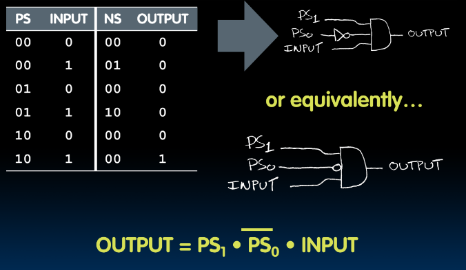

# BA: Circuit & Algebraic Simplification

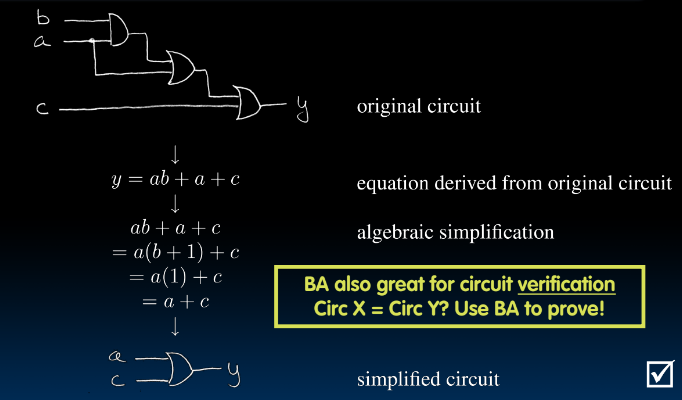
- b + 1 -> 1
    - b or 1 == 1

# Laws of Boolean Algebra

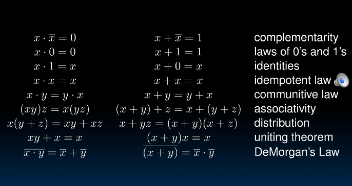

# Canonical Forms

## 1

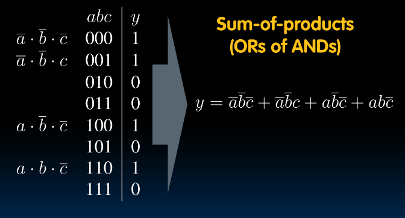

- create expression for every outputted 1

## 2

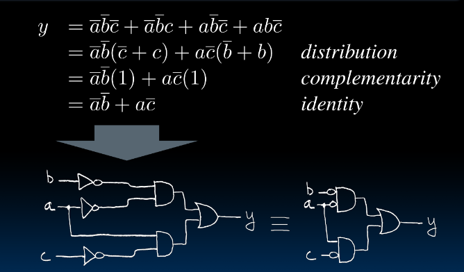
