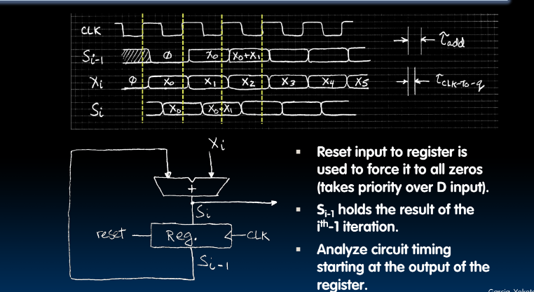
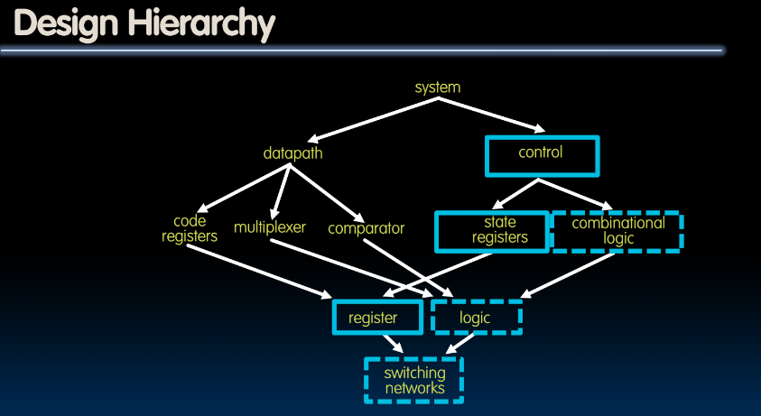

# Introduction to Synchronous Digital Systems (SDS) State

## Accumulator

### Uses for State Elements

- A place to store values for some indeterminate amount of time
    - Register files (like x0-x31 on the RISC-V)
    - Memory (cahces, and main memory)
- Help control the flow of information between combinational logic blocks
    - State eleemnts are used to hold up the movement of information tat the inputs to combinational logic blocks and allow for orderly passage.

## Accumulator Example

## First Try

## Second Try

# Register Details Flip-flops
## Register Details...What's inside?

## timing of a flip-flop

- clock is consistent
- checks to see if d is rising edge when clock is rising edge

## timing of a flip-flop 2

- input needs to be stable for +/- margin before rising edge
- time before rising edge is called set up time, d should be stable
- time after rising edge is called hold time, d should be stable
- "clk-to-q" delay time for how long hold time is

## Accumulator Revisited 1/2

## Accumulator Revisited 2/2

- if reset is high ignore other outputs
- output becomes 0 after clk-q-delay
- $X_i$ add to $S_i - 1$ to become $S_i$

# Pipelining for Performance
## Maximum Clock Frequency

## Pipelining to improve performance 1

## Recap of Timing Terms

## Finite State Machines

### Examples

### Hardware implementations

## General Model for Synchrnonous Systems

## Design Hierarchy

