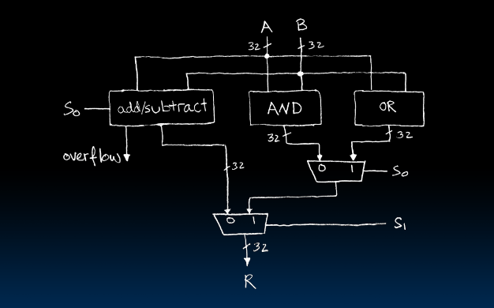

# Combinational Logic Blocks

## Data Multiplexors

### here 2-to-1, n-bit-wide

- A and B are trying to visit a one lane road

- let `a` pass if `s` is `1`, else let `b` pass if `s` is `0`

# How do we build a 1-bit-wide mux?

- need gate for every expression, and ...

# 4-to-1 Multiplexor

# Mux: is there any other way to do it?

# Arithmetic Logic Unit (ALU)

# Our simple ALU

- 32 bit AND/OR -> 32 parallel bits

# Adder / Subtractor

## One-bit adder (1/2)

## One-bit adder (2/2)

## `N` 1-bit adders

