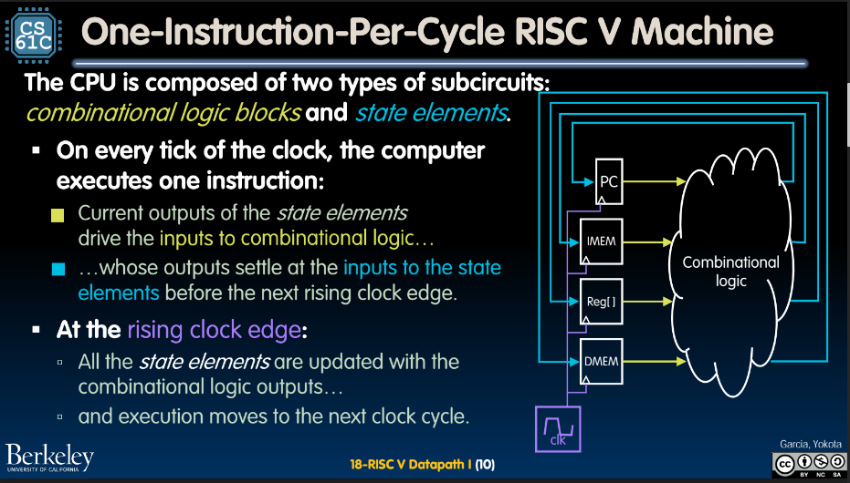

# RISC V Datapath 1

- Control -> marionette of the program directing everything, brain
- Datapath -> all the hardware, how to make it all happen, brawn

## Combinational Logic Blocks

- In one clock cycle, execute one instruction (rising edge)
- ex. add, operation gets written at next crack of dawn at rising edge and execution moves for next clock cycle

- stored program idea, program and data both live in memory

- 3 five bit operations for operation, for 2 registers to get data, and 1 register to put data
- data2 gets ignores by mux for i-type instructions

## Implementing add

