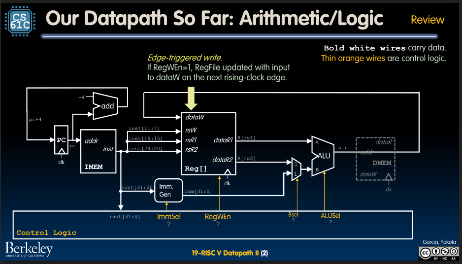
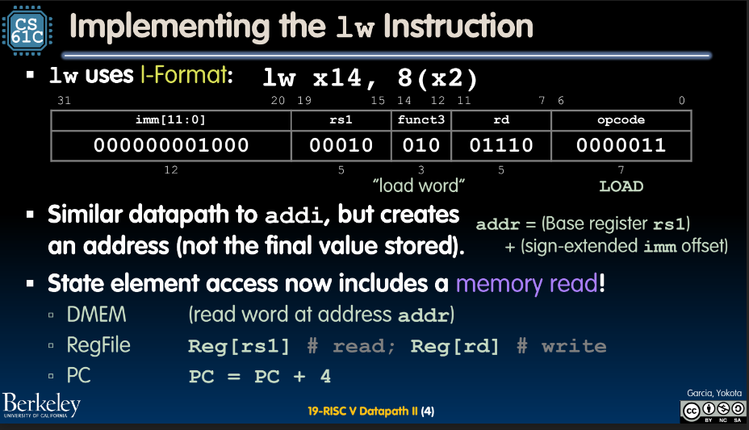
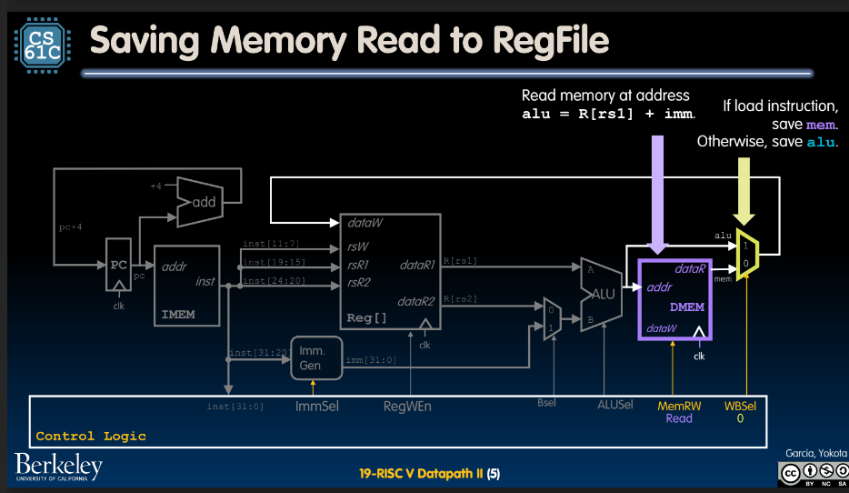
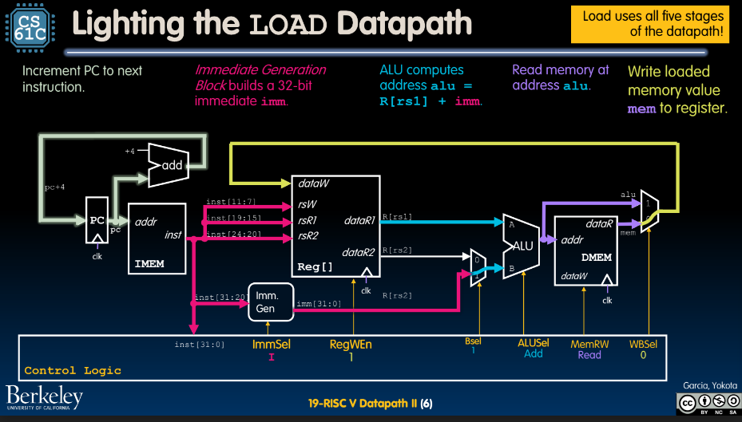
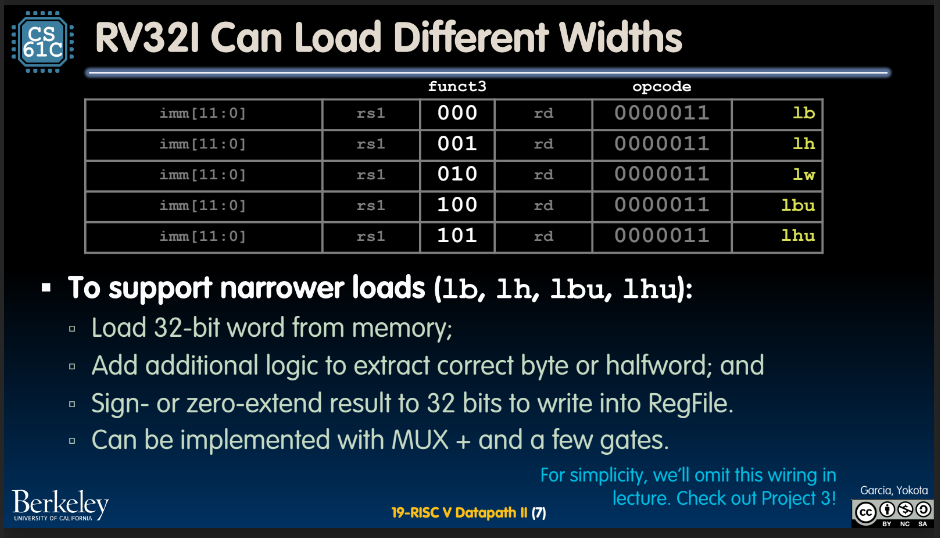
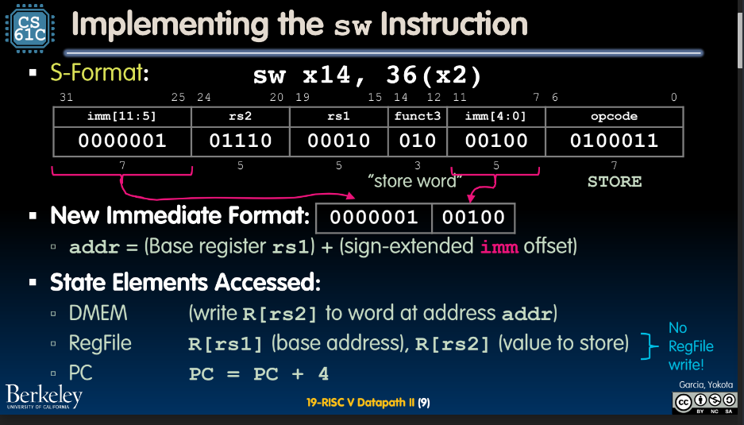
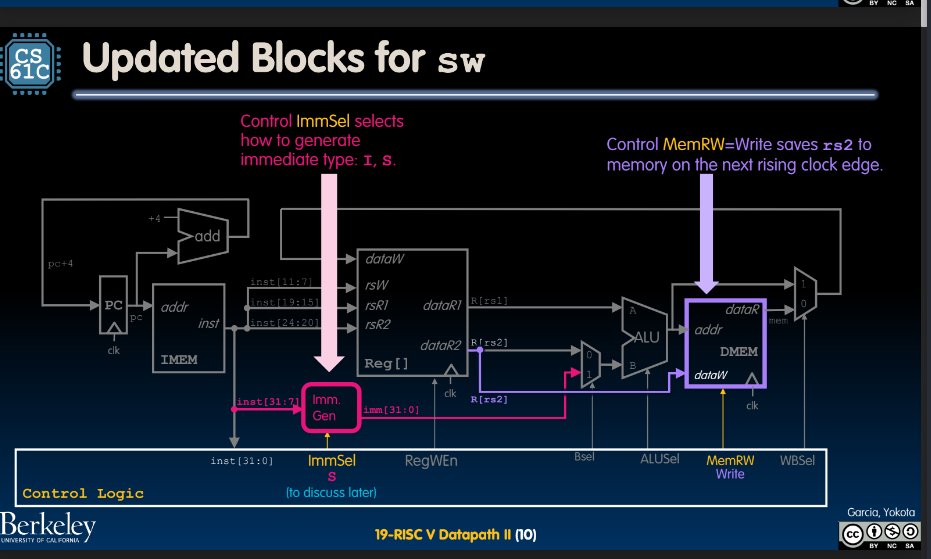
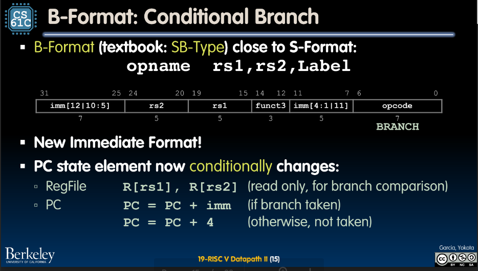
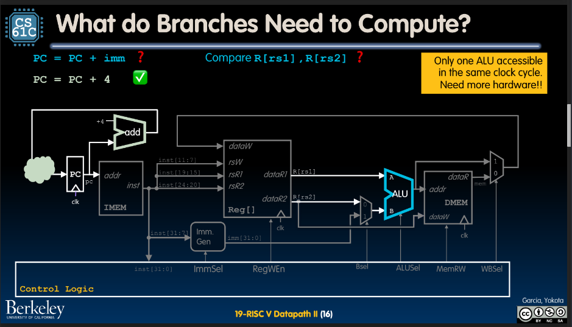
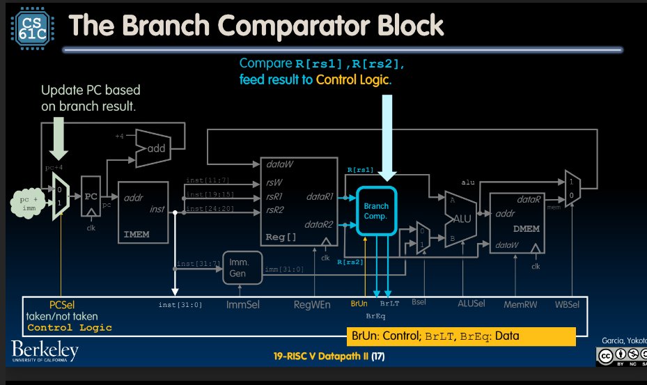

# RISC V Datapath 2

## Implementing Loads

## Saving Memory Read to RegFile

- light up with clock cycle, load in `load` instruction
- load bits into the right registers/places

## Implementing stores

- writeback goes to sleep, since we are writing to registers and not to memory
- how do we tell system to go to sleep

## B-Format

