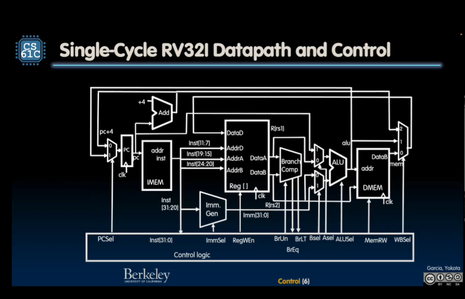
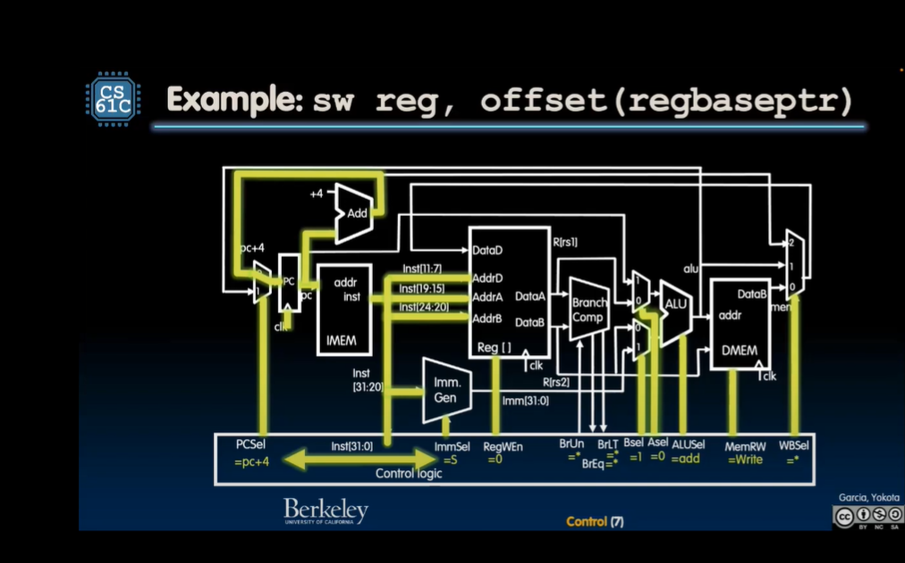

# Single Cycle RV32 Datapath and Control

Example sw reg, offset (regbaseptr)

1. clock rises 
2. clocks in new store word, read instruction **IMEM**, plug bits into register file and imm gen
3. Control Logic wakes up
4. set pc = pc + 4
5. **ImmSel** say's it's an **S-Type** Instruction
6. **RegWEn** set off, not writing to register
7. **Br__** don't care, since not branching
8. BSel -> 1
9. ASel -> 0
10. ALU -> add
11. **MemRW** set to write
12. Don't care about WBSel

**ImmSel** -> used to identify type of instruction and piece together immediate

**beq** -> changes PC

## *add* Execution

## Instruction Timing

