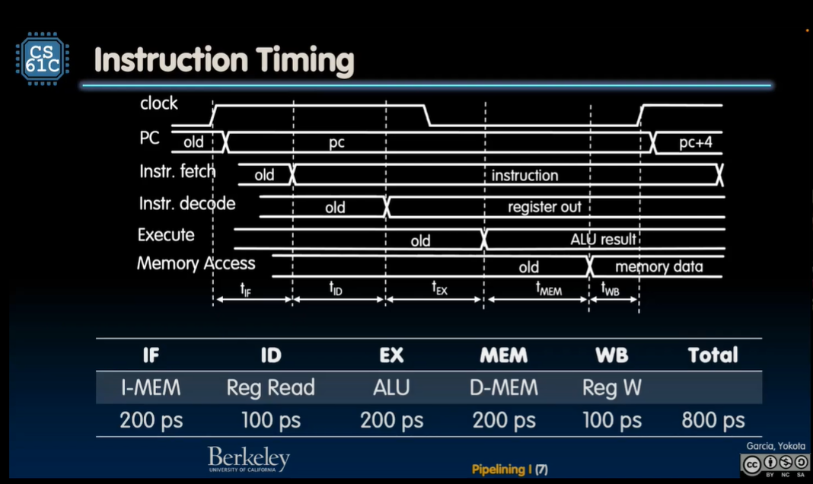
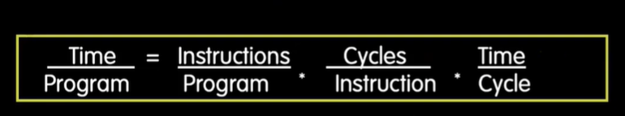
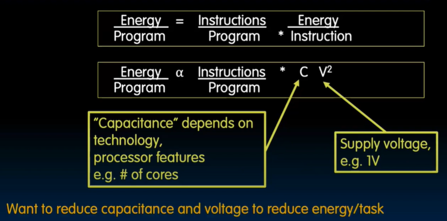
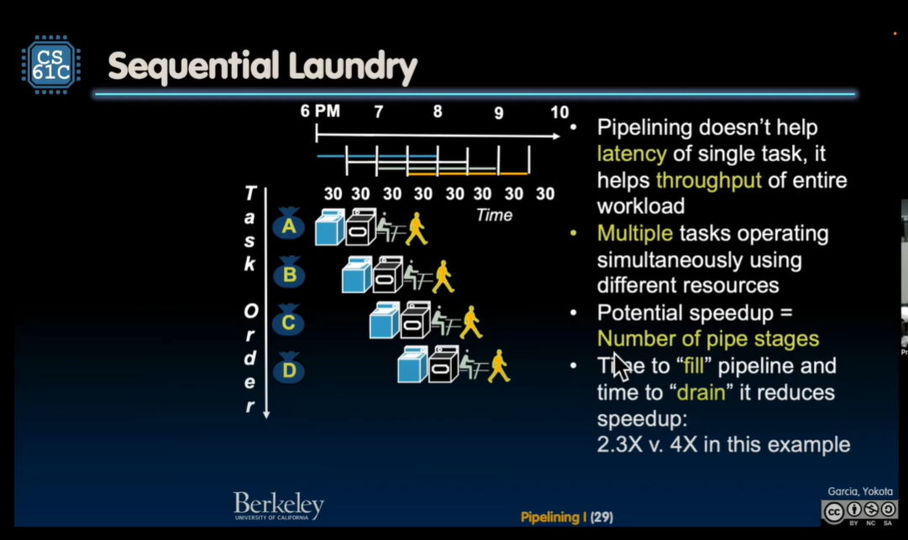

# Instruction TimingA

- Single-cycle RISC-V CPU executes instrs at 1.25 GHz
    - 1 instruction every 800 ps

## "Iron Law" of Processor Performance

- Cycles Per Instruction -> CPI

### Instructions per Program

Determined by
- Task
- Algorithm
- Programming Language
- Compiler
- Instruction Set Architecture

### Average CPI
- CPI = 1 for RISCV

### Time per Cycle (1/Frequency)
- Determined by critical path

### Energy Efficiency (Energy per Task)

## Introduction to Pipe lining

