# RISC-V pipeline pt 2

# symbolic representation of 5 stages
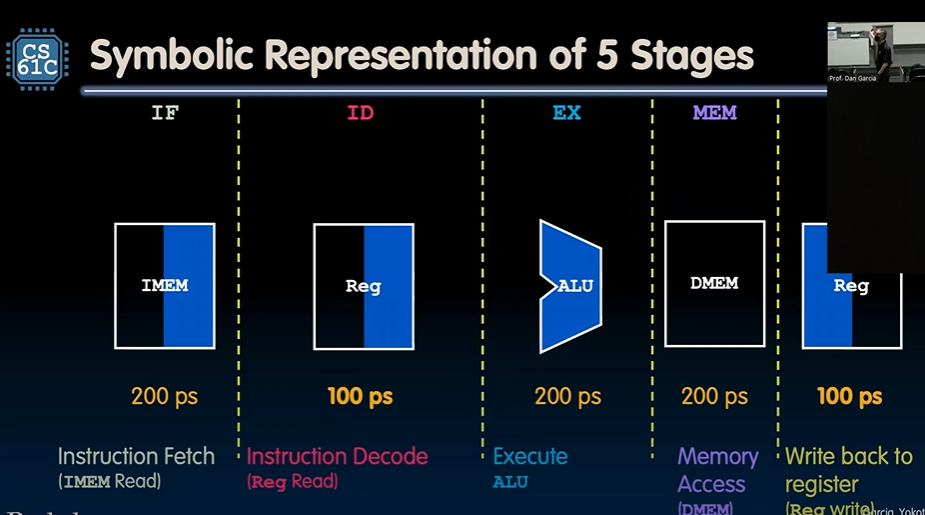
- blue part is where it is being activated
- `IMEM`: read in second half
- writing in first half, reading in second

# Pipelined CPU
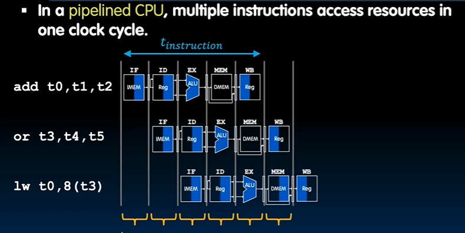

# Performance (1/2): Latency
- timing of stage is the longest stage
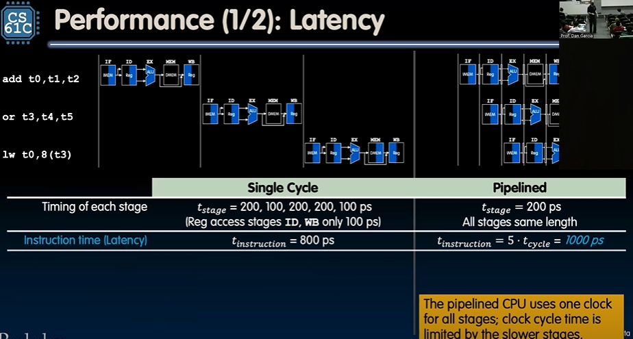

# Performance (2/2): Throughput
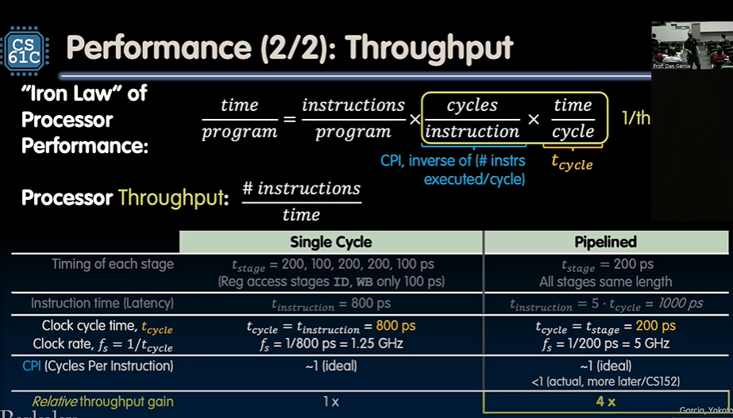
- cpi: why isn't cpi 5? but only 1 output per clock cycle

# Pipelined Datapath and Control

A pipelined datapath needs to "separate" the five stages of the datapath

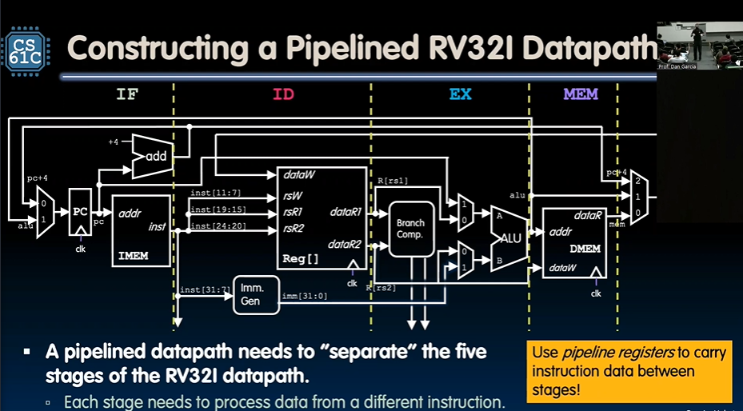

## IF/ID Pipeline Registers

- `IF/ID` has two pipeline registers, $PC_ID$, $inst_ID$
    - store instruction and PC in register
- increment PC to PC + 4 for next `IF` stage

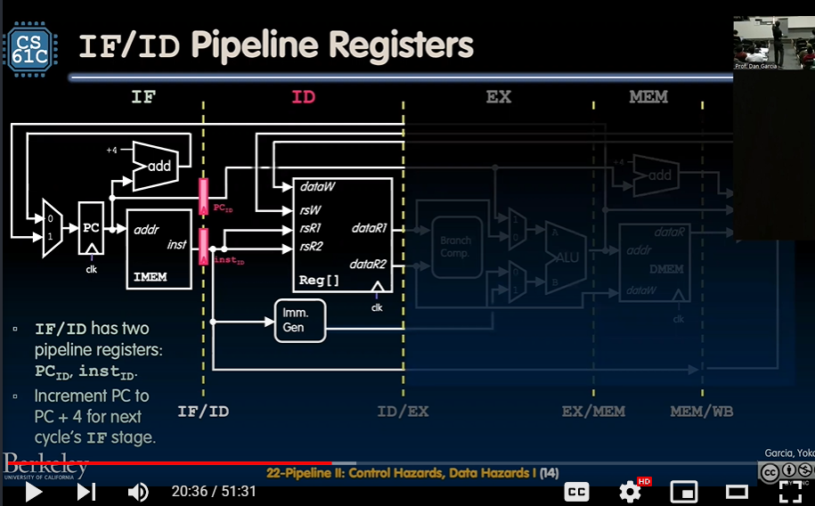

## Other transitions

- essentially hold all values that transition from one stage to another
- Control logic pipe lining is much harder
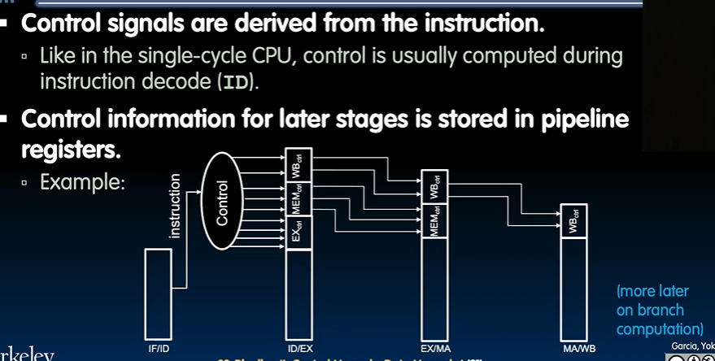

# Structural Hazards
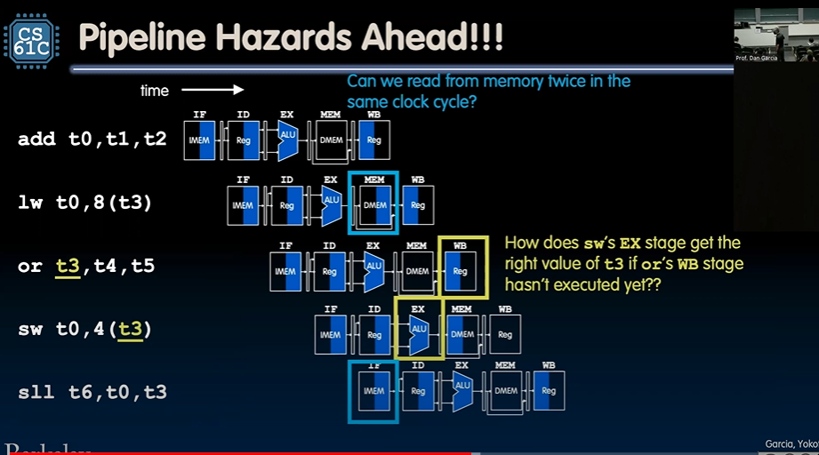
How do branches work?

## Hazards
Structural - hardware does not support access across multiple instructions in same cycle
Data - Instructions have data dependency, need to wait for prev instruction to complete data read/write
Control - flow of execute depends on prev instruction

## Structural
- Regfiles read up to 3 operands in ID and write up to 1 in WB stage
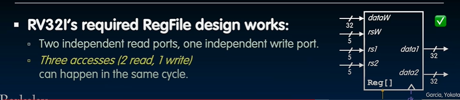
- separate IMEM and DMEM

## Data
- when instruction reads register before prev register has finished writing to that register
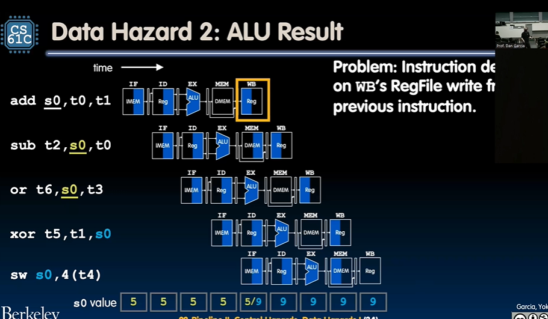
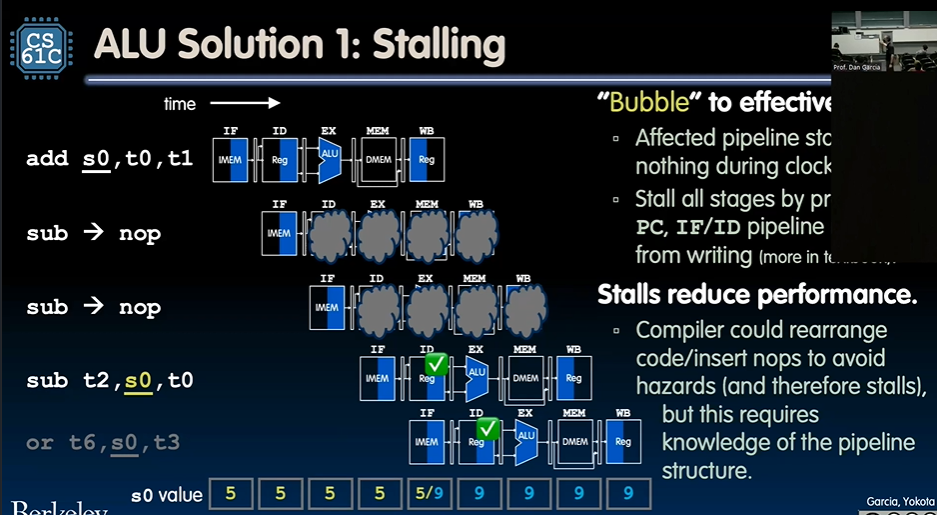
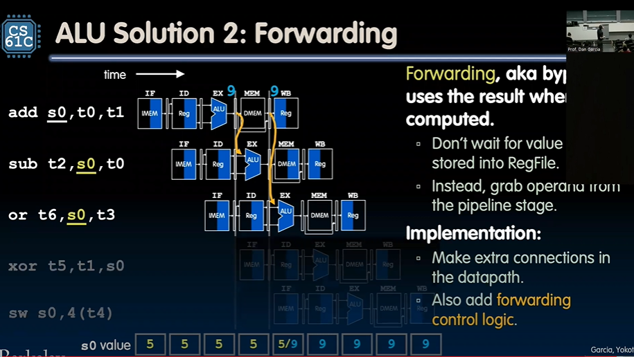
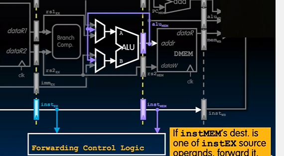

